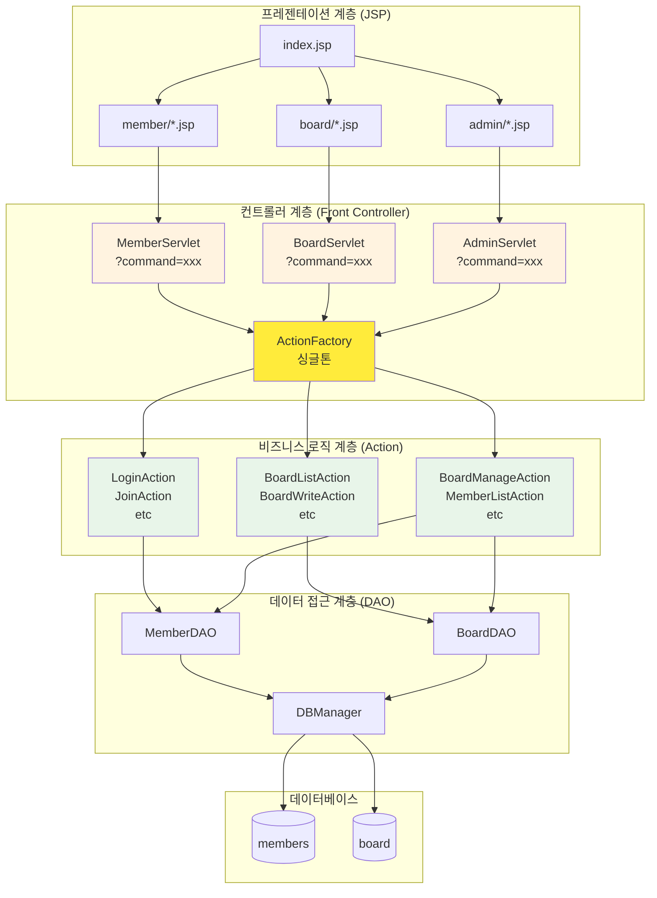
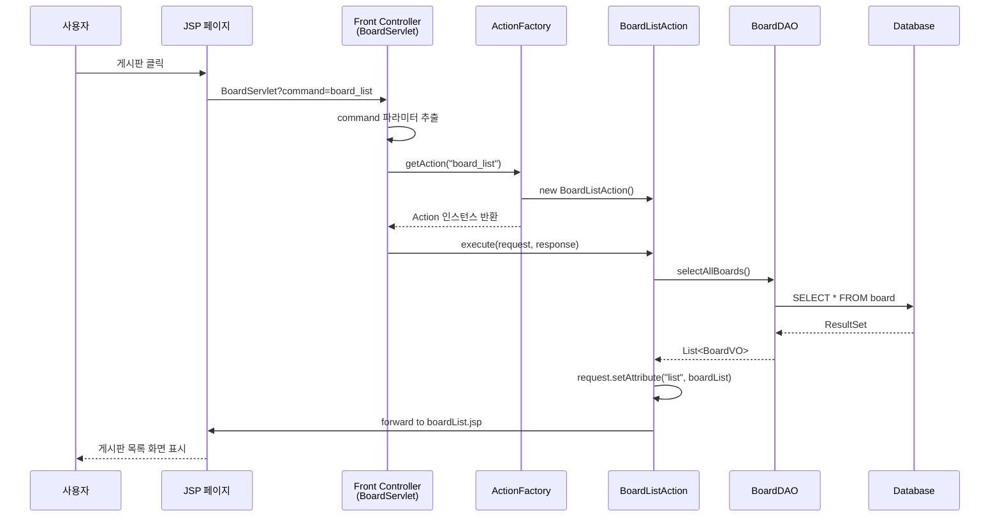
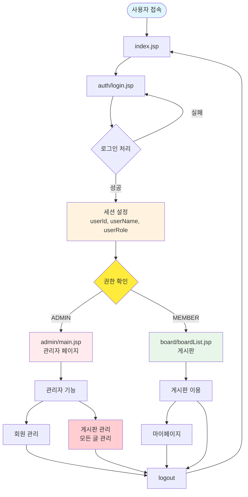
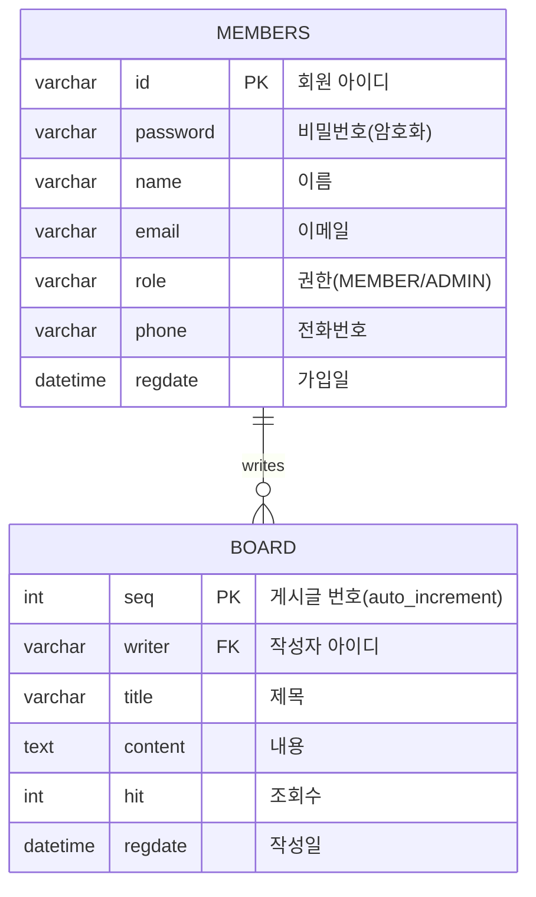
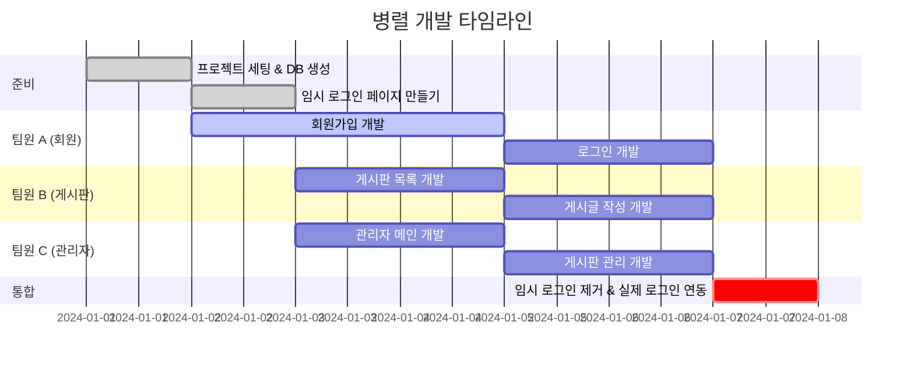
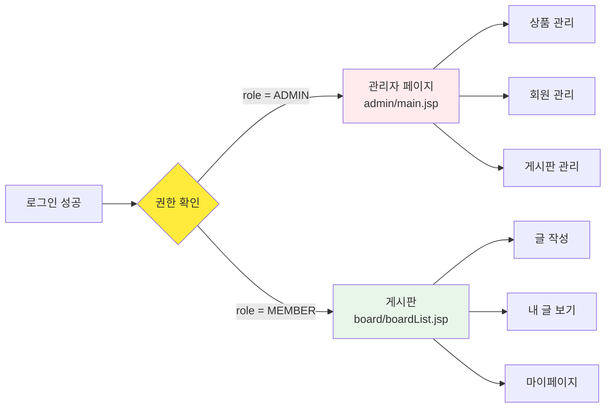

# 통합 JSP 프로젝트 가이드 (로그인 + 게시판 + 관리자)

> [!NOTE]
> **문서 역할 안내**
> 
> 이 문서는 **기술 구현 방법**에 집중합니다 (패턴, 아키텍처, 코드 예시).
> 
> **Git 협업, 브랜치 전략, Pull Request** 등은 **`팀원별_브랜치_작업_가이드.md`** 파일을 참조하세요.

## 📋 프로젝트 개요

### 기반 프로젝트
- **web-study-09**: 회원 관리 시스템 (로그인, 회원가입, 회원정보 수정)
- **web-study-10**: 상품 관리 시스템 (CRUD 기능)
- **web-study-11**: 게시판 시스템 (목록, 작성, 상세보기, 수정, 삭제)
  - ⚠️ **통합 시 주의**: web-study-11은 독립형 게시판 (비밀번호 기반)
  - 실제 구현된 Action 클래스: `BoardListAction`, `BoardWriteFormAction`, `BoardWriteAction`, `BoardViewAction`, `BoardCheckPassFormAction`, `BoardCheckPassAction`, `BoardUpdateFormAction`, `BoardUpdateAction`, `BoardDeleteAction`
  - 통합 프로젝트에서는 회원 연동형으로 변환 필요 (`writer` 필드로 변경, 비밀번호 대신 세션 기반 권한 관리)

### 통합 목표
세 개의 학습 프로젝트를 통합하여 **로그인, 게시판, 관리자 페이지가 연동되는 웹 애플리케이션**을 구축합니다.

### 핵심 기능
1. **인증 시스템**: 회원가입 (일반/관리자), 로그인, 세션 기반 인증
2. **권한 관리**: 일반 회원(MEMBER)과 관리자(ADMIN) 구분
3. **역할별 접근**:
   - 관리자 회원가입: 관리자 인증 코드 필요
   - 관리자 로그인 → 관리자 페이지(게시판 관리)로 이동
   - 일반회원 로그인 → 게시판으로 이동
4. **게시판 권한**:
   - 일반 회원: 자기가 쓴 글만 수정/삭제 가능
   - 관리자: **모든 글 수정/삭제 가능** (게시판 관리)
5. **관리자 기능**: 회원 관리, **전체 게시판 관리**

---

## 📁 프로젝트 폴더 구조 (Front Controller 패턴)

> [!IMPORTANT]
> **web-study-11의 발전된 패턴 적용**
> 
> 이 프로젝트는 **web-study-11**에서 학습한 **Front Controller 패턴**을 전체에 적용합니다.
> - **하나의 Servlet**으로 모든 요청 처리 (각 기능별: MemberServlet, BoardServlet, AdminServlet)
> - **ActionFactory**로 command에 따라 적절한 Action 실행
> - **Action 인터페이스**를 구현한 클래스들이 실제 비즈니스 로직 처리

```
board-project/                    # 프로젝트 루트 폴더
├── src/
│   └── main/
│       ├── java/
│       │   ├── com/
│       │   │   └── saeyan/           # 패키지명 (기존 학습과 동일)
│       │   │       │
│       │   │       ├── controller/   # 📌 Front Controller Servlet들
│       │   │       │   ├── MemberServlet.java      # 회원 관련 모든 요청 처리
│       │   │       │   ├── BoardServlet.java       # 게시판 관련 모든 요청 처리
│       │   │       │   ├── AdminServlet.java       # 관리자 관련 모든 요청 처리
│       │   │       │   │
│       │   │       │   ├── ActionFactory.java      # ⭐ Action 생성 팩토리 (web-study-11 패턴)
│       │   │       │   │
│       │   │       │   └── action/                 # 📂 Action 구현 클래스들
│       │   │       │       ├── Action.java         # Action 인터페이스
│       │   │       │       │
│       │   │       │       ├── member/             # 회원 관련 Action
│       │   │       │       │   ├── LoginAction.java
│       │   │       │       │   ├── LoginFormAction.java
│       │   │       │       │   ├── LogoutAction.java
│       │   │       │       │   ├── JoinAction.java
│       │   │       │       │   ├── JoinFormAction.java
│       │   │       │       │   └── UpdateAction.java
│       │   │       │       │
│       │   │       │       ├── board/              # 게시판 관련 Action
│       │   │       │       │   ├── BoardListAction.java
│       │   │       │       │   ├── BoardViewAction.java
│       │   │       │       │   ├── BoardWriteFormAction.java
│       │   │       │       │   ├── BoardWriteAction.java
│       │   │       │       │   ├── BoardUpdateFormAction.java
│       │   │       │       │   ├── BoardUpdateAction.java
│       │   │       │       │   └── BoardDeleteAction.java
│       │   │       │       │
│       │   │       │       └── admin/              # 관리자 관련 Action
│       │   │       │           ├── AdminMainAction.java
│       │   │       │           ├── MemberListAction.java
│       │   │       │           ├── MemberDetailAction.java
│       │   │       │           ├── BoardManageListAction.java
│       │   │       │           ├── BoardManageDeleteAction.java
│       │   │       │           └── BoardManageUpdateAction.java
│       │   │       │
│       │   │       ├── dao/          # DAO (Data Access Object)
│       │   │       │   ├── MemberDAO.java
│       │   │       │   └── BoardDAO.java
│       │   │       │
│       │   │       └── dto/          # VO (Value Object)
│       │   │           ├── MemberVO.java
│       │   │           └── BoardVO.java
│       │   │
│       │   └── util/                 # 유틸리티
│       │       └── DBManager.java    # DB 연결 관리 (web-study-10, 11과 동일)
│       │
│       └── webapp/
│           ├── WEB-INF/
│           │   ├── web.xml          # 서블릿 매핑 설정
│           │   └── lib/              # 라이브러리 (ojdbc 등)
│           │
│           ├── index.jsp             # 메인 페이지
│           │
│           ├── member/               # 👤 회원 관련 JSP
│           │   ├── login.jsp         # 로그인 페이지
│           │   ├── join.jsp          # 회원가입 페이지
│           │   ├── idCheck.jsp       # ID 중복 체크
│           │   ├── main.jsp          # 회원 메인 (로그인 후)
│           │   └── memberUpdate.jsp  # 회원정보 수정
│           │
│           ├── board/                # 📝 게시판 JSP (web-study-11 구조)
│           │   ├── boardList.jsp     # 게시글 목록
│           │   ├── boardWrite.jsp    # 게시글 작성 폼
│           │   ├── boardView.jsp     # 게시글 상세보기
│           │   └── boardUpdate.jsp   # 게시글 수정 폼
│           │
│           ├── admin/                # 👨‍💼 관리자 페이지
│           │   ├── adminMain.jsp     # 관리자 메인 (대시보드)
│           │   │
│           │   ├── member/           # 회원 관리
│           │   │   ├── memberList.jsp
│           │   │   └── memberDetail.jsp
│           │   │
│           │   └── board/            # 게시판 관리
│           │       ├── boardManage.jsp      # 전체 게시글 관리
│           │       └── boardManageDelete.jsp
│           │
│           ├── css/                  # 스타일시트
│           │   └── style.css
│           │
│           └── script/               # 자바스크립트
│               └── common.js
```

### 🎯 Front Controller 패턴의 장점

| 전통적인 방식 | Front Controller 패턴 |
|-------------|----------------------|
| 각 기능마다 별도 Servlet 생성 | **하나의 Servlet**으로 관련 기능 통합 |
| Servlet이 많아지면 관리 어려움 | ActionFactory로 **중앙 집중 관리** |
| web.xml 설정이 복잡해짐 | web.xml 설정 **간소화** |
| 코드 중복 가능성 높음 | Action 인터페이스로 **표준화** |

### 📌 기존 학습 프로젝트와의 연결

| 기능 | 참고 프로젝트 | 주요 패턴 |
|------|-------------|----------|
| **회원 관리** | web-study-09 | MemberServlet + ActionFactory → LoginAction, JoinAction |
| **게시판 (일반회원)** | web-study-11 | **BoardServlet + ActionFactory** (완전 동일 패턴) |
| **게시판 관리 (관리자)** | web-study-11 응용 | AdminServlet + ActionFactory → BoardManageAction 등 |
| **DB 연결** | web-study-10, 11 | `util/DBManager.java` |

---

## 🏗️ 시스템 아키텍처 (Front Controller 패턴)



### 📝 Front Controller 흐름도



---
### 🔍 URL 패턴 예시

Front Controller 패턴에서는 **command 파라미터**로 어떤 작업을 할지 결정합니다:

| 기능 | URL 예시 |
|------|----------|
| 로그인 폼 | `/MemberServlet?command=login_form` |
| 로그인 처리 | `/MemberServlet?command=login` (POST) |
| 회원가입 폼 | `/MemberServlet?command=join_form` |
| 회원가입 처리 | `/MemberServlet?command=join` (POST) |
| 게시판 목록 | `/BoardServlet?command=board_list` |
| 게시글 작성 폼 | `/BoardServlet?command=board_write_form` |
| 게시글 작성 처리 | `/BoardServlet?command=board_write` (POST) |
| 게시글 상세 | `/BoardServlet?command=board_view&seq=1` |
| 관리자 메인 | `/AdminServlet?command=admin_main` |
| 전체 게시글 관리 | `/AdminServlet?command=board_manage_list` |
| 회원 목록 | `/AdminServlet?command=member_list` |

---

## 🔄 사용자 플로우

### 로그인 및 권한 기반 접근 플로우



---

## 🗄️ 데이터베이스 설계

### ERD (Entity Relationship Diagram)



### 테이블 생성 SQL

> [!NOTE]
> **학습용 vs 통합 프로젝트 테이블 구조**
> 
> **web-study-11 (학습용 - 독립형 게시판):**
> ```sql
> CREATE TABLE board (
>     num INT AUTO_INCREMENT PRIMARY KEY,
>     name VARCHAR(30),           -- 작성자 이름 (수동 입력)
>     pass VARCHAR(30) NOT NULL,  -- 게시글 비밀번호
>     email VARCHAR(30),          -- 이메일 (수동 입력)
>     title VARCHAR(50),
>     content VARCHAR(1000),
>     readcount INT DEFAULT 0,
>     writedate DATETIME DEFAULT CURRENT_TIMESTAMP
> );
> ```
> 
> **통합 프로젝트 (회원 연동형):**
> - `writer` 필드로 변경: 로그인한 회원 ID 저장
> - `pass`, `name`, `email` 필드 제거: members 테이블과 조인하여 사용
> - 세션 기반 권한 관리로 비밀번호 불필요

```sql
-- 회원 테이블
CREATE TABLE members (
    id VARCHAR(50) PRIMARY KEY,
    password VARCHAR(100) NOT NULL,
    name VARCHAR(50) NOT NULL,
    email VARCHAR(100),
    role VARCHAR(20) DEFAULT 'MEMBER',  -- 'MEMBER' 또는 'ADMIN'
    phone VARCHAR(20),
    regdate DATETIME DEFAULT CURRENT_TIMESTAMP
);

-- 게시판 테이블 (통합 프로젝트용 - 회원 연동형)
CREATE TABLE board (
    seq INT AUTO_INCREMENT PRIMARY KEY,
    writer VARCHAR(50) NOT NULL,
    title VARCHAR(200) NOT NULL,
    content TEXT NOT NULL,
    hit INT DEFAULT 0,
    regdate DATETIME DEFAULT CURRENT_TIMESTAMP,
    FOREIGN KEY (writer) REFERENCES members(id) ON DELETE CASCADE
);

-- 기본 관리자 계정 생성 (게시판 관리자)
INSERT INTO members (id, password, name, email, role) 
VALUES ('admin', 'admin1234', '관리자', 'admin@example.com', 'ADMIN');

-- 테스트 일반 회원 계정
INSERT INTO members (id, password, name, email, role) 
VALUES ('user1', '1234', '홍길동', 'user1@example.com', 'MEMBER');
```

### 🎯 관리자와 일반 회원의 게시판 권한

| 구분 | 본인 글 | 타인 글 | 비고 |
|------|:------:|:------:|------|
| **일반 회원 (MEMBER)** | ✅ 조회/수정/삭제 | ⚠️ 조회만 가능 | 자기가 작성한 글만 관리 |
| **관리자 (ADMIN)** | ✅ 조회/수정/삭제 | ✅ 조회/수정/삭제 | **모든 글 관리 권한** |

> [!TIP]
> **관리자의 게시판 관리 기능**
> - 부적절한 게시글 삭제
> - 중요 공지사항 수정
> - 전체 게시글 통계 확인
> - 회원별 게시 활동 모니터링

---

## 🔄 web-study-11에서 회원 연동형으로 전환하기

> [!IMPORTANT]
> **통합 프로젝트 핵심 변경사항**
> 
> web-study-11은 학습용 독립형 게시판(비밀번호 기반)이지만, 
> 통합 프로젝트는 **회원 연동형 게시판**(세션 기반)으로 전환해야 합니다.

### 📊 변경사항 요약

| 항목 | web-study-11 (독립형) | 통합 프로젝트 (회원 연동형) |
|------|---------------------|------------------------|
| **작성자 필드** | `name VARCHAR(30)` - 수동 입력 | `writer VARCHAR(50)` - 세션에서 자동 (FK) |
| **비밀번호 필드** | `pass VARCHAR(30)` - 필수 | ❌ 제거 (세션으로 권한 관리) |
| **이메일 필드** | `email VARCHAR(30)` - 수동 입력 | ❌ 제거 (members 조인) |
| **테이블 컬럼명** | `num`, `readcount`, `writedate` | `seq`, `hit`, `regdate` |
| **비밀번호 확인** | `boardCheckPass.jsp` 팝업 | ❌ 제거 (세션 확인) |
| **권한 관리** | 비밀번호 일치 여부 | `userId == writer` 또는 `role == 'ADMIN'` |

### 1️⃣ 데이터베이스 스키마 변경

#### 기존 web-study-11 테이블

```sql
CREATE TABLE board (
    num INT AUTO_INCREMENT PRIMARY KEY,
    name VARCHAR(30),           -- 작성자 이름 (수동 입력)
    pass VARCHAR(30) NOT NULL,  -- 게시글 비밀번호
    email VARCHAR(30),          -- 이메일 (수동 입력)
    title VARCHAR(50),
    content VARCHAR(1000),
    readcount INT DEFAULT 0,
    writedate DATETIME DEFAULT CURRENT_TIMESTAMP
);
```

#### 통합 프로젝트 테이블 (회원 연동형)

```sql
CREATE TABLE board (
    seq INT AUTO_INCREMENT PRIMARY KEY,      -- num → seq 변경
    writer VARCHAR(50) NOT NULL,             -- name → writer 변경 (FK)
    title VARCHAR(200) NOT NULL,             -- 길이 50 → 200
    content TEXT NOT NULL,                   -- VARCHAR(1000) → TEXT
    hit INT DEFAULT 0,                       -- readcount → hit 변경
    regdate DATETIME DEFAULT CURRENT_TIMESTAMP,  -- writedate → regdate 변경
    FOREIGN KEY (writer) REFERENCES members(id) ON DELETE CASCADE
);
```

**주요 변경점:**
- ✅ `writer` 필드 추가: 회원 ID (members 테이블 FK)
- ❌ `name`, `pass`, `email` 필드 제거
- ✅ Foreign Key 제약조건 추가: 회원 탈퇴 시 게시글 자동 삭제

### 2️⃣ BoardVO 클래스 수정

**통합 프로젝트 BoardVO:**

```java
public class BoardVO {
    private int seq;           // num → seq
    private String writer;     // name → writer (회원 ID)
    private String title;
    private String content;
    private int hit;           // readcount → hit
    private Timestamp regdate; // writedate → regdate
    
    // pass, email 필드 제거
    
    // JOIN으로 가져올 회원 정보 (임시 필드, 테이블 컬럼 아님)
    private String writerName;   // members.name
    private String writerEmail;  // members.email
    
    // getter/setter...
}
```

### 3️⃣ JSP 파일 수정

#### boardWrite.jsp 변경

**통합 프로젝트:**

```jsp
<%-- 로그인 체크 --%>
<%@ include file="../common/checkLogin.jsp" %>
<%
    String userId = (String) session.getAttribute("userId");
    String userName = (String) session.getAttribute("userName");
%>

<form name="frm" method="post" action="BoardServlet">
    <input type="hidden" name="command" value="board_write">
    <input type="hidden" name="writer" value="<%= userId %>">  <%-- 세션에서 자동 설정 --%>
    
    <tr>
        <th>작성자</th>
        <td><%= userName %> (로그인한 사용자)</td>
    </tr>
    <%-- name, pass, email 입력란 제거 --%>
    <tr>
        <th>제목</th>
        <td><input type="text" size="70" name="title"> * 필수</td>
    </tr>
    <tr>
        <th>내용</th>
        <td><textarea cols="70" rows="15" name="content"></textarea></td>
    </tr>
</form>
```

#### boardView.jsp 변경

**통합 프로젝트:**

```jsp
<%
    String sessionUserId = (String) session.getAttribute("userId");
    String sessionUserRole = (String) session.getAttribute("userRole");
    
    // 권한 체크: 작성자 본인이거나 관리자
    boolean canEdit = sessionUserId.equals(board.getWriter()) || 
                      "ADMIN".equals(sessionUserRole);
%>

<tr>
    <th>작성자</th>
    <td>${board.writerName}</td>  <%-- members 테이블 조인으로 가져옴 --%>
    <th>이메일</th>
    <td>${board.writerEmail}</td>
</tr>

<!-- 권한이 있을 때만 수정/삭제 버튼 표시 -->
<% if(canEdit) { %>
    <input type="button" value="게시글 수정" 
        onclick="location.href='BoardServlet?command=board_update_form&seq=${board.seq}'">
    <input type="button" value="게시글 삭제"
        onclick="if(confirm('정말 삭제하시겠습니까?')) location.href='BoardServlet?command=board_delete&seq=${board.seq}'">
<% } %>
```

#### 삭제할 JSP 파일

```bash
# 비밀번호 확인 관련 파일 삭제
rm src/main/webapp/board/boardCheckPass.jsp
rm src/main/webapp/board/checkSuccess.jsp
```

### 4️⃣ Action 클래스 수정

#### BoardWriteAction 수정

```java
public String execute(HttpServletRequest request, HttpServletResponse response) {
    // 세션에서 로그인 정보 가져오기
    HttpSession session = request.getSession();
    String userId = (String) session.getAttribute("userId");
    
    // 로그인 체크
    if(userId == null) {
        return "redirect:../member/login.jsp";
    }
    
    String title = request.getParameter("title");
    String content = request.getParameter("content");
    
    BoardVO vo = new BoardVO();
    vo.setWriter(userId);  // 세션에서 자동 설정
    vo.setTitle(title);
    vo.setContent(content);
    
    BoardDAO dao = BoardDAO.getInstance();
    dao.insertBoard(vo);
    
    return "redirect:BoardServlet?command=board_list";
}
```

#### BoardUpdateAction, BoardDeleteAction 수정

```java
public String execute(HttpServletRequest request, HttpServletResponse response) {
    // 세션에서 로그인 정보 가져오기
    HttpSession session = request.getSession();
    String sessionUserId = (String) session.getAttribute("userId");
    String sessionUserRole = (String) session.getAttribute("userRole");
    
    int seq = Integer.parseInt(request.getParameter("seq"));
    
    // 기존 게시글 조회
    BoardDAO dao = BoardDAO.getInstance();
    BoardVO board = dao.selectOneBySeq(seq);
    
    // 권한 체크
    boolean canEdit = sessionUserId.equals(board.getWriter()) ||
                      "ADMIN".equals(sessionUserRole);
    
    if(!canEdit) {
        request.setAttribute("message", "권한이 없습니다.");
        return "board/boardList.jsp";
    }
    
    // 수정 또는 삭제 처리...
}
```

#### 삭제할 Action 클래스

```java
// BoardCheckPassFormAction.java - 삭제
// BoardCheckPassAction.java - 삭제
```

### 5️⃣ DAO 수정 (members 조인)

게시글 조회 시 작성자 정보 함께 가져오기:

```java
public BoardVO selectOneBySeq(int seq) {
    String sql = "SELECT b.seq, b.writer, b.title, b.content, b.hit, b.regdate, " +
                 "       m.name AS writerName, m.email AS writerEmail " +
                 "FROM board b " +
                 "INNER JOIN members m ON b.writer = m.id " +
                 "WHERE b.seq = ?";
    
    // ResultSet에서
    vo.setSeq(rs.getInt("seq"));
    vo.setWriter(rs.getString("writer"));
    vo.setTitle(rs.getString("title"));
    vo.setContent(rs.getString("content"));
    vo.setHit(rs.getInt("hit"));
    vo.setRegdate(rs.getTimestamp("regdate"));
    
    // JOIN으로 가져온 회원 정보
    vo.setWriterName(rs.getString("writerName"));
    vo.setWriterEmail(rs.getString("writerEmail"));
    
    return vo;
}
```

### 6️⃣ ActionFactory 수정

```java
public Action getAction(String command) {
    Action action = null;
    
    if(command.equals("board_list")) {
        action = new BoardListAction();
    } else if(command.equals("board_write_form")) {
        action = new BoardWriteFormAction();
    } else if(command.equals("board_write")) {
        action = new BoardWriteAction();
    } else if(command.equals("board_view")) {
        action = new BoardViewAction();
    
    // ❌ 비밀번호 확인 관련 제거
    // } else if(command.equals("board_check_pass_form")) {
    //     action = new BoardCheckPassFormAction();
    // } else if(command.equals("board_check_pass")) {
    //     action = new BoardCheckPassAction();
    
    } else if(command.equals("board_update_form")) {
        action = new BoardUpdateFormAction();
    } else if(command.equals("board_update")) {
        action = new BoardUpdateAction();
    } else if(command.equals("board_delete")) {
        action = new BoardDeleteAction();
    }
    
    return action;
}
```

### 7️⃣ 전환 체크리스트

- [ ] **데이터베이스**
  - [ ] board 테이블 스키마 변경 (writer 추가, name/pass/email 제거)
  - [ ] Foreign Key 제약조건 추가

- [ ] **Java 클래스**
  - [ ] BoardVO 필드 수정 (writer, seq, hit, regdate추가, writerName/writerEmail 추가)
  - [ ] BoardDAO JOIN 쿼리 추가
  - [ ] BoardWriteAction 세션 기반으로 수정
  - [ ] BoardUpdateAction, BoardDeleteAction 권한 체크 변경
  - [ ] BoardCheckPassFormAction, BoardCheckPassAction 삭제
  - [ ] ActionFactory 수정

- [ ] **JSP 파일**
  - [ ] boardWrite.jsp 수정 (로그인 체크, writer 자동 설정)
  - [ ] boardView.jsp 수정 (세션 권한 체크)
  - [ ] boardUpdate.jsp 수정 (pass 필드 제거)
  - [ ] boardCheckPass.jsp, checkSuccess.jsp 삭제

- [ ] **공통 파일**
  - [ ] checkLogin.jsp 생성 (로그인 체크 공통 파일)

### 8️⃣ 통합 프로젝트의 장점

| 장점 | 설명 |
|------|------|
| ✅ **보안 강화** | 비밀번호 노출 위험 없음 (세션 기반) |
| ✅ **사용자 편의성** | 작성자 정보 자동 입력, 비밀번호 기억 불필요 |
| ✅ **데이터 무결성** | 회원 탈퇴 시 게시글 자동 삭제 (CASCADE) |
| ✅ **관리자 기능** | 모든 게시글 관리 권한 |
| ✅ **회원 추적** | 회원별 게시 활동 모니터링 가능 |

---


## 🚀 개발 전략: 로그인 없이 병렬 개발하기

> [!TIP]
> **실무 팁: 팀원별 병렬 개발**
> 
> 로그인 담당자의 작업이 완료되기 전에도 게시판 담당자와 관리자 담당자는 개발을 진행할 수 있습니다!

### 문제 상황 🤔

```
팀원 A: 로그인/회원가입 개발 중... (진행률 30%)
팀원 B: 게시판 개발 시작하고 싶은데, 세션 정보가 필요함!
팀원 C: 관리자 페이지 개발 시작하고 싶은데, 세션 정보가 필요함!
```

**문제**: 게시판과 관리자 페이지는 세션의 `userId`, `userRole` 정보가 필요한데, 로그인이 완성되지 않았습니다.

---

### 해결책 1: 임시 세션 설정 페이지 만들기 ⭐ (추천)

개발 단계에서만 사용할 **임시 로그인 페이지**를 만듭니다.

#### `test/testLogin.jsp` (임시 개발용)

```jsp
<%@ page language="java" contentType="text/html; charset=UTF-8" pageEncoding="UTF-8"%>
<!DOCTYPE html>
<html>
<head>
    <title>임시 로그인 (개발용)</title>
    <style>
        body { font-family: Arial; padding: 20px; }
        .warning { background: #fff3cd; padding: 15px; border-left: 4px solid #ffc107; margin-bottom: 20px; }
        button { padding: 10px 20px; margin: 5px; cursor: pointer; font-size: 16px; }
        .member { background: #28a745; color: white; }
        .admin { background: #dc3545; color: white; }
    </style>
</head>
<body>
    <div class="warning">
        <strong>⚠️ 개발 전용 페이지</strong><br>
        이 페이지는 로그인 기능이 완성되기 전까지만 사용하는 임시 페이지입니다.<br>
        실제 배포 시 반드시 삭제해야 합니다!
    </div>
    
    <h2>임시 로그인 (개발 테스트용)</h2>
    <p>아래 버튼을 클릭하여 원하는 권한으로 세션을 설정하세요:</p>
    
    <!-- 일반 회원으로 로그인 -->
    <form action="testLoginProcess.jsp" method="post">
        <input type="hidden" name="userId" value="user1">
        <input type="hidden" name="userName" value="홍길동">
        <input type="hidden" name="userRole" value="MEMBER">
        <button type="submit" class="member">일반 회원으로 시작</button>
    </form>
    
    <!-- 관리자로 로그인 -->
    <form action="testLoginProcess.jsp" method="post">
        <input type="hidden" name="userId" value="admin">
        <input type="hidden" name="userName" value="관리자">
        <input type="hidden" name="userRole" value="ADMIN">
        <button type="submit" class="admin">관리자로 시작</button>
    </form>
    
    <hr>
    <p>현재 세션 정보:</p>
    <ul>
        <li>userId: <%= session.getAttribute("userId") %></li>
        <li>userName: <%= session.getAttribute("userName") %></li>
        <li>userRole: <%= session.getAttribute("userRole") %></li>
    </ul>
</body>
</html>
```

#### `test/testLoginProcess.jsp`

```jsp
<%@ page language="java" contentType="text/html; charset=UTF-8" pageEncoding="UTF-8"%>
<%
    // 폼에서 받은 데이터로 세션 설정
    String userId = request.getParameter("userId");
    String userName = request.getParameter("userName");
    String userRole = request.getParameter("userRole");
    
    // 세션에 저장 (실제 로그인과 동일한 방식)
    session.setAttribute("userId", userId);
    session.setAttribute("userName", userName);
    session.setAttribute("userRole", userRole);
    
    // 권한에 따라 리다이렉션
    if("ADMIN".equals(userRole)) {
        response.sendRedirect("../admin/adminMain.jsp");
    } else {
        response.sendRedirect("../board/boardList.jsp");
    }
%>
```

#### 사용 방법

1. **게시판 개발자 (팀원 B)**
   - `http://localhost:8080/프로젝트명/test/testLogin.jsp` 접속
   - "일반 회원으로 시작" 클릭
   - → 세션이 설정되어 게시판 개발 가능! ✅

2. **관리자 페이지 개발자 (팀원 C)**
   - `http://localhost:8080/프로젝트명/test/testLogin.jsp` 접속
   - "관리자로 시작" 클릭
   - → 세션이 설정되어 관리자 페이지 개발 가능! ✅

---

### 해결책 2: 세션 체크 임시 비활성화

개발 중에는 로그인 체크를 주석 처리합니다.

#### 원래 코드 (`board/boardList.jsp`)

```jsp
<%-- 로그인 체크 --%>
<%@ include file="../common/checkLogin.jsp" %>

<%
    String userId = (String) session.getAttribute("userId");
    String userRole = (String) session.getAttribute("userRole");
    // ... 게시판 로직
%>
```

#### 개발 단계 임시 코드

```jsp
<%-- TODO: 로그인 완성 후 주석 해제! --%>
<%-- @ include file="../common/checkLogin.jsp" --%>

<%
    // 임시: 개발용 더미 데이터
    String userId = "user1";  // 실제: (String) session.getAttribute("userId");
    String userRole = "MEMBER";  // 실제: (String) session.getAttribute("userRole");
    
    // ... 게시판 로직 (변경 없음)
%>
```

> [!WARNING]
> **주의사항**
> - 이 방법은 **개발 단계에서만** 사용
> - 로그인 기능 완성 후 **반드시 원래대로 복구**
> - Git에 커밋할 때 주석과 TODO를 명확히 작성

---

### 해결책 3: 조건부 개발 모드

환경 변수로 개발 모드를 설정합니다.

#### `common/devMode.jsp`

```jsp
<%!
    // 개발 모드 설정 (로그인 완성 후 false로 변경)
    public static final boolean DEV_MODE = true;
    
    // 개발용 더미 세션 정보
    public static final String DEV_USER_ID = "user1";
    public static final String DEV_USER_NAME = "홍길동";
    public static final String DEV_USER_ROLE = "MEMBER";  // 또는 "ADMIN"
%>

<%
    String userId, userName, userRole;
    
    if(DEV_MODE) {
        // 개발 모드: 더미 데이터 사용
        userId = DEV_USER_ID;
        userName = DEV_USER_NAME;
        userRole = DEV_USER_ROLE;
        
        // 개발 편의를 위해 세션에도 설정
        session.setAttribute("userId", userId);
        session.setAttribute("userName", userName);
        session.setAttribute("userRole", userRole);
    } else {
        // 실제 모드: 세션에서 가져오기
        userId = (String) session.getAttribute("userId");
        userName = (String) session.getAttribute("userName");
        userRole = (String) session.getAttribute("userRole");
        
        // 로그인 체크
        if(userId == null) {
            response.sendRedirect("../member/login.jsp");
            return;
        }
    }
%>
```

#### 사용 예시 (`board/boardList.jsp`)

```jsp
<%@ include file="../common/devMode.jsp" %>

<%
    // userId, userName, userRole 변수를 바로 사용 가능!
    out.println("현재 사용자: " + userName + " (" + userId + ")");
    out.println("권한: " + userRole);
%>
```

---

### 📋 팀별 역할 분담 및 개발 순서



### ✅ 개발 완료 후 체크리스트

로그인 기능이 완성되면 다음 단계를 수행하세요:

- [ ] `test/` 폴더 전체 삭제
- [ ] 모든 JSP에서 임시 코드 제거
- [ ] `devMode.jsp`의 `DEV_MODE`를 `false`로 변경
- [ ] 세션 체크 주석 해제
- [ ] 전체 테스트 수행
- [ ] Git에서 개발용 파일 제거

---

##  핵심 구현 가이드

### 1️⃣ 회원가입 (일반회원 vs 관리자)

회원가입 시 **일반회원**과 **관리자** 중 선택할 수 있습니다. 관리자로 가입하려면 **관리자 인증 코드**가 필요합니다.

#### 회원가입 폼 (`auth/join.jsp`)

```jsp
<%@ page language="java" contentType="text/html; charset=UTF-8" pageEncoding="UTF-8"%>
<!DOCTYPE html>
<html>
<head>
    <title>회원가입</title>
</head>
<body>
    <h2>회원가입</h2>
    <form action="joinProcess.jsp" method="post" onsubmit="return validateForm()">
        <div>
            <label>아이디:</label>
            <input type="text" name="id" id="id" required>
            <button type="button" onclick="checkDuplicate()">중복확인</button>
        </div>
        
        <div>
            <label>비밀번호:</label>
            <input type="password" name="password" required>
        </div>
        
        <div>
            <label>이름:</label>
            <input type="text" name="name" required>
        </div>
        
        <div>
            <label>이메일:</label>
            <input type="email" name="email">
        </div>
        
        <div>
            <label>회원 유형:</label>
            <input type="radio" name="role" value="MEMBER" checked onchange="toggleAdminCode()"> 일반회원
            <input type="radio" name="role" value="ADMIN" onchange="toggleAdminCode()"> 관리자
        </div>
        
        <!-- 관리자 인증 코드 입력란 (기본적으로 숨김) -->
        <div id="adminCodeDiv" style="display:none;">
            <label>관리자 인증 코드:</label>
            <input type="password" name="adminCode" id="adminCode">
            <small style="color:red;">※ 관리자 인증 코드를 입력해주세요</small>
        </div>
        
        <button type="submit">가입하기</button>
    </form>
    
    <script>
        // 관리자 선택 시 인증 코드 입력란 표시
        function toggleAdminCode() {
            const role = document.querySelector('input[name="role"]:checked').value;
            const adminCodeDiv = document.getElementById('adminCodeDiv');
            const adminCodeInput = document.getElementById('adminCode');
            
            if(role === 'ADMIN') {
                adminCodeDiv.style.display = 'block';
                adminCodeInput.required = true;
            } else {
                adminCodeDiv.style.display = 'none';
                adminCodeInput.required = false;
                adminCodeInput.value = '';
            }
        }
        
        function validateForm() {
            const role = document.querySelector('input[name="role"]:checked').value;
            const adminCode = document.getElementById('adminCode').value;
            
            if(role === 'ADMIN' && !adminCode) {
                alert('관리자 인증 코드를 입력해주세요.');
                return false;
            }
            return true;
        }
    </script>
</body>
</html>
```

#### 회원가입 처리 (`auth/joinProcess.jsp`)

```jsp
<%@ page language="java" contentType="text/html; charset=UTF-8" pageEncoding="UTF-8"%>
<%@ page import="com.yourproject.dao.MemberDAO"%>
<%@ page import="com.yourproject.dto.MemberDTO"%>
<%
    request.setCharacterEncoding("UTF-8");
    
    // 관리자 인증 코드 (실제로는 설정 파일이나 DB에 저장)
    final String ADMIN_SECRET_CODE = "admin2024!";
    
    // 폼 데이터 받기
    String id = request.getParameter("id");
    String password = request.getParameter("password");
    String name = request.getParameter("name");
    String email = request.getParameter("email");
    String role = request.getParameter("role");
    String adminCode = request.getParameter("adminCode");
    
    // 관리자 가입 시 인증 코드 검증
    if("ADMIN".equals(role)) {
        if(adminCode == null || !adminCode.equals(ADMIN_SECRET_CODE)) {
            out.println("<script>");
            out.println("alert('관리자 인증 코드가 올바르지 않습니다.');");
            out.println("history.back();");
            out.println("</script>");
            return;
        }
    }
    
    // DTO에 데이터 담기
    MemberDTO member = new MemberDTO();
    member.setId(id);
    member.setPassword(password);  // 실제로는 암호화 필요
    member.setName(name);
    member.setEmail(email);
    member.setRole(role);
    
    // DAO를 통해 DB에 저장
    MemberDAO dao = MemberDAO.getInstance();
    boolean success = dao.insertMember(member);
    
    if(success) {
        out.println("<script>");
        out.println("alert('회원가입이 완료되었습니다.');");
        out.println("location.href='login.jsp';");
        out.println("</script>");
    } else {
        out.println("<script>");
        out.println("alert('회원가입에 실패했습니다.');");
        out.println("history.back();");
        out.println("</script>");
    }
%>
```

> [!IMPORTANT]
> **관리자 인증 코드 관리**
> - 예제에서는 하드코딩되어 있지만, 실제로는 설정 파일이나 환경 변수에 저장해야 합니다.
> - 보안을 위해 정기적으로 변경하는 것이 좋습니다.
> - 예시 코드: `admin2024!` (실제 프로젝트에서는 더 복잡한 코드 사용)

---

### 2️⃣ 로그인 및 권한별 리다이렉션

로그인 성공 시 **권한(role)**에 따라 다른 페이지로 이동합니다.

#### 로그인 처리 (`auth/loginProcess.jsp`)

```jsp
<%@ page language="java" contentType="text/html; charset=UTF-8" pageEncoding="UTF-8"%>
<%@ page import="com.yourproject.dao.MemberDAO"%>
<%@ page import="com.yourproject.dto.MemberDTO"%>
<%
    request.setCharacterEncoding("UTF-8");
    
    String id = request.getParameter("id");
    String password = request.getParameter("password");
    
    // DAO를 통해 로그인 검증
    MemberDAO dao = MemberDAO.getInstance();
    MemberDTO member = dao.login(id, password);
    
    if(member != null) {
        // 로그인 성공 - 세션 설정
        session.setAttribute("userId", member.getId());
        session.setAttribute("userName", member.getName());
        session.setAttribute("userRole", member.getRole());  // "MEMBER" 또는 "ADMIN"
        
        // 권한별 리다이렉션
        if("ADMIN".equals(member.getRole())) {
            // 관리자 → 관리자 페이지
            response.sendRedirect("../admin/main.jsp");
        } else {
            // 일반회원 → 게시판
            response.sendRedirect("../board/boardList.jsp");
        }
    } else {
        // 로그인 실패
        out.println("<script>");
        out.println("alert('아이디 또는 비밀번호가 올바르지 않습니다.');");
        out.println("history.back();");
        out.println("</script>");
    }
%>
```

#### 권한별 페이지 접근 흐름



---

### 3️⃣ 게시판 권한 관리

게시판에서 **수정/삭제 권한**은 다음과 같이 동작합니다:

| 권한 | 본인 글 | 타인 글 |
|------|:------:|:------:|
| **일반회원 (MEMBER)** | ✅ 수정/삭제 가능 | ❌ 수정/삭제 불가 |
| **관리자 (ADMIN)** | ✅ 수정/삭제 가능 | ✅ 수정/삭제 가능 |

#### 권한 체크 공통 함수 (`common/checkPermission.jsp`)

```jsp
<%!
// 게시글 수정/삭제 권한 체크 함수
public boolean canEditPost(String sessionUserId, String sessionUserRole, String postWriter) {
    if(sessionUserId == null) {
        return false;  // 로그인 안 함
    }
    
    // 관리자이거나 본인이 쓴 글이면 true
    return "ADMIN".equals(sessionUserRole) || sessionUserId.equals(postWriter);
}
%>
```

#### 게시글 목록에서 버튼 표시 (`board/boardList.jsp`)

```jsp
<%@ page language="java" contentType="text/html; charset=UTF-8" pageEncoding="UTF-8"%>
<%@ page import="java.util.List"%>
<%@ page import="com.yourproject.dao.BoardDAO"%>
<%@ page import="com.yourproject.dto.BoardDTO"%>
<%@ include file="../common/checkLogin.jsp" %>

<%
    // 세션에서 로그인 정보 가져오기
    String sessionUserId = (String) session.getAttribute("userId");
    String sessionUserRole = (String) session.getAttribute("userRole");
    
    // 게시글 목록 가져오기
    BoardDAO dao = BoardDAO.getInstance();
    List<BoardDTO> boardList = dao.selectAllBoards();
%>

<!DOCTYPE html>
<html>
<head>
    <title>게시판</title>
</head>
<body>
    <h2>게시판</h2>
    
    <% if("ADMIN".equals(sessionUserRole)) { %>
        <p style="color:red;">🔑 관리자 모드: 모든 글을 수정/삭제할 수 있습니다.</p>
    <% } %>
    
    <table border="1">
        <thead>
            <tr>
                <th>번호</th>
                <th>제목</th>
                <th>작성자</th>
                <th>작성일</th>
                <th>관리</th>
            </tr>
        </thead>
        <tbody>
            <%
                for(BoardDTO board : boardList) {
                    String writer = board.getWriter();
                    
                    // 권한 체크: 자기 글이거나 관리자면 true
                    boolean canEdit = "ADMIN".equals(sessionUserRole) || 
                                     sessionUserId.equals(writer);
            %>
            <tr>
                <td><%= board.getSeq() %></td>
                <td><a href="boardView.jsp?seq=<%= board.getSeq() %>"><%= board.getTitle() %></a></td>
                <td><%= writer %></td>
                <td><%= board.getRegdate() %></td>
                <td>
                    <% if(canEdit) { %>
                        <a href="boardUpdate.jsp?seq=<%= board.getSeq() %>">수정</a>
                        <a href="boardDelete.jsp?seq=<%= board.getSeq() %>" 
                           onclick="return confirm('정말 삭제하시겠습니까?')">삭제</a>
                    <% } else { %>
                        <span style="color:#ccc;">-</span>
                    <% } %>
                </td>
            </tr>
            <% } %>
        </tbody>
    </table>
    
    <br>
    <a href="boardWrite.jsp">글쓰기</a>
</body>
</html>
```

#### 수정/삭제 처리 시 서버 측 권한 재확인

> [!WARNING]
> **보안 중요**: 클라이언트(버튼 숨김)만으로는 보안이 보장되지 않습니다. 
> 수정/삭제 처리 시 **서버 측에서 반드시 권한을 재확인**해야 합니다!

**수정 처리 예시** (`board/boardUpdateProcess.jsp`):

```jsp
<%
    // 세션 정보
    String sessionUserId = (String) session.getAttribute("userId");
    String sessionUserRole = (String) session.getAttribute("userRole");
    
    // 수정할 글 번호
    int seq = Integer.parseInt(request.getParameter("seq"));
    
    // 기존 게시글 정보 가져오기
    BoardDAO dao = BoardDAO.getInstance();
    BoardDTO board = dao.selectBoard(seq);
    
    // 권한 체크 (중요!)
    boolean canEdit = "ADMIN".equals(sessionUserRole) || 
                     sessionUserId.equals(board.getWriter());
    
    if(!canEdit) {
        out.println("<script>");
        out.println("alert('수정 권한이 없습니다.');");
        out.println("location.href='boardList.jsp';");
        out.println("</script>");
        return;
    }
    
    // 권한 확인 후 수정 처리
    String title = request.getParameter("title");
    String content = request.getParameter("content");
    
    board.setTitle(title);
    board.setContent(content);
    dao.updateBoard(board);
    
    response.sendRedirect("boardList.jsp");
%>
```

---

## �🛠️ 게시판 구현 가이드

### 1. 데이터베이스 (Board 테이블)
아주 간단하게 만듭니다.

```sql
CREATE TABLE board (
    num NUMBER PRIMARY KEY,          -- 글번호
    title VARCHAR2(100),             -- 제목
    content VARCHAR2(1000),          -- 내용
    writer VARCHAR2(50),             -- 작성자 (userid와 연결)
    regdate DATE DEFAULT SYSDATE     -- 작성일
);

CREATE SEQUENCE board_seq; -- 번호 자동 생성기
```

**중요**: `writer` 필드는 회원 테이블의 `userid`와 연결됩니다. 로그인한 사용자의 `userid`를 저장하여 권한 체크에 사용합니다.

### 2. 파일 구조 (예시)
```
src/main/java/
  └── com/simple/
       ├── DBConn.java      -- DB 연결
       ├── BoardVO.java     -- 데이터 객체
       └── BoardDAO.java    -- CRUD 기능 (insert, update, delete, select)

src/main/webapp/
  ├── board/
  │    ├── list.jsp         -- 목록 페이지
  │    ├── write.jsp        -- 작성 폼
  │    ├── write_action.jsp -- 작성 처리 (Java 코드)
  │    ├── update.jsp       -- 수정 폼
  │    ├── update_action.jsp -- 수정 처리
  │    └── delete_action.jsp -- 삭제 처리
  └── index.jsp             -- 메인 (목록으로 이동 링크)
```

### 3. 핵심 로직 힌트

#### 🔐 권한 체크 (매우 중요!)

**모든 수정/삭제 작업 전에 반드시 권한을 확인해야 합니다!**

```jsp
<%-- JSP에서 권한 체크 예시 --%>
<%
  // 1. 세션에서 로그인 정보 가져오기
  HttpSession session = request.getSession();
  MemberVO loginUser = (MemberVO) session.getAttribute("loginUser");
  
  // 2. 로그인 안 했으면 로그인 페이지로
  if(loginUser == null) {
    response.sendRedirect("../member/login.jsp");
    return;
  }
  
  // 3. 현재 글의 작성자와 로그인한 사용자 비교
  String loginUserId = loginUser.getUserid();  // 로그인한 사용자 아이디
  String boardWriter = vo.getWriter();         // 글 작성자 아이디
  int admin = loginUser.getAdmin();            // 관리자 여부 (0=일반, 1=관리자)
  
  // 4. 권한 체크: 자신의 글이거나 관리자여야 함
  boolean canEdit = loginUserId.equals(boardWriter) || admin == 1;
%>
```

**Java (Servlet/JSP)에서 권한 체크 함수 예시:**
```java
// 권한 체크 메서드 (공통으로 사용)
public boolean checkPermission(HttpServletRequest request, String boardWriter) {
    HttpSession session = request.getSession();
    MemberVO loginUser = (MemberVO) session.getAttribute("loginUser");
    
    // 로그인 안 했으면 false
    if(loginUser == null) {
        return false;
    }
    
    String loginUserId = loginUser.getUserid();
    int admin = loginUser.getAdmin();
    
    // 자신의 글이거나 관리자면 true
    return loginUserId.equals(boardWriter) || admin == 1;
}
```

---

#### 📝 글 작성 (Write)

**`write.jsp`**:
```jsp
<%-- 로그인 체크 --%>
<%
  HttpSession session = request.getSession();
  MemberVO loginUser = (MemberVO) session.getAttribute("loginUser");
  if(loginUser == null) {
    response.sendRedirect("../member/login.jsp");
    return;
  }
%>

<form action="write_action.jsp" method="post">
  <input type="hidden" name="writer" value="<%=loginUser.getUserid()%>">
  <input type="text" name="title" placeholder="제목">
  <textarea name="content" placeholder="내용"></textarea>
  <input type="submit" value="작성">
</form>
```

**`write_action.jsp`**: 
```jsp
<%
  // 1. 로그인 체크
  HttpSession session = request.getSession();
  MemberVO loginUser = (MemberVO) session.getAttribute("loginUser");
  if(loginUser == null) {
    response.sendRedirect("../member/login.jsp");
    return;
  }
  
  // 2. 폼 데이터 받기
  String title = request.getParameter("title");
  String content = request.getParameter("content");
  String writer = loginUser.getUserid();  // 세션에서 가져오기 (보안!)
  
  // 3. BoardVO에 담기
  BoardVO vo = new BoardVO();
  vo.setTitle(title);
  vo.setContent(content);
  vo.setWriter(writer);
  
  // 4. DAO로 저장
  BoardDAO dao = BoardDAO.getInstance();
  dao.insertBoard(vo);
  
  // 5. 목록으로 이동
  response.sendRedirect("list.jsp");
%>
```

---

#### ✏️ 글 수정 (Update)

**`list.jsp`에서 수정 버튼 표시:**
```jsp
<%-- 각 게시글마다 권한 체크 후 버튼 표시 --%>
<%
  String loginUserId = loginUser != null ? loginUser.getUserid() : "";
  int admin = loginUser != null ? loginUser.getAdmin() : 0;
  boolean canEdit = loginUserId.equals(vo.getWriter()) || admin == 1;
%>

<% if(canEdit) { %>
  <a href="update.jsp?num=<%=vo.getNum()%>">수정</a>
<% } %>
```

**`update.jsp`** (수정 폼):
```jsp
<%
  // 1. 로그인 체크
  HttpSession session = request.getSession();
  MemberVO loginUser = (MemberVO) session.getAttribute("loginUser");
  if(loginUser == null) {
    response.sendRedirect("../member/login.jsp");
    return;
  }
  
  // 2. 글번호로 게시글 가져오기
  int num = Integer.parseInt(request.getParameter("num"));
  BoardDAO dao = BoardDAO.getInstance();
  BoardVO vo = dao.selectBoard(num);
  
  // 3. 권한 체크 (중요!)
  String loginUserId = loginUser.getUserid();
  int admin = loginUser.getAdmin();
  if(!loginUserId.equals(vo.getWriter()) && admin != 1) {
    // 권한 없음!
    response.sendRedirect("list.jsp");
    return;
  }
%>

<form action="update_action.jsp" method="post">
  <input type="hidden" name="num" value="<%=vo.getNum()%>">
  <input type="text" name="title" value="<%=vo.getTitle()%>">
  <textarea name="content"><%=vo.getContent()%></textarea>
  <input type="submit" value="수정">
</form>
```

**`update_action.jsp`** (수정 처리):
```jsp
<%
  // 1. 로그인 체크
  HttpSession session = request.getSession();
  MemberVO loginUser = (MemberVO) session.getAttribute("loginUser");
  if(loginUser == null) {
    response.sendRedirect("../member/login.jsp");
    return;
  }
  
  // 2. 폼 데이터 받기
  int num = Integer.parseInt(request.getParameter("num"));
  String title = request.getParameter("title");
  String content = request.getParameter("content");
  
  // 3. 기존 게시글 가져오기 (권한 체크용)
  BoardDAO dao = BoardDAO.getInstance();
  BoardVO vo = dao.selectBoard(num);
  
  // 4. 권한 체크 (중요!)
  String loginUserId = loginUser.getUserid();
  int admin = loginUser.getAdmin();
  if(!loginUserId.equals(vo.getWriter()) && admin != 1) {
    // 권한 없음!
    response.sendRedirect("list.jsp");
    return;
  }
  
  // 5. 수정 내용 저장
  vo.setTitle(title);
  vo.setContent(content);
  dao.updateBoard(vo);
  
  // 6. 목록으로 이동
  response.sendRedirect("list.jsp");
%>
```

---

#### 🗑️ 글 삭제 (Delete)

**`list.jsp`에서 삭제 버튼 표시:**
```jsp
<%-- 각 게시글마다 권한 체크 후 버튼 표시 --%>
<%
  String loginUserId = loginUser != null ? loginUser.getUserid() : "";
  int admin = loginUser != null ? loginUser.getAdmin() : 0;
  boolean canDelete = loginUserId.equals(vo.getWriter()) || admin == 1;
%>

<% if(canDelete) { %>
  <a href="delete_action.jsp?num=<%=vo.getNum()%>" 
     onclick="return confirm('정말 삭제하시겠습니까?')">삭제</a>
<% } %>
```

**`delete_action.jsp`**:
```jsp
<%
  // 1. 로그인 체크
  HttpSession session = request.getSession();
  MemberVO loginUser = (MemberVO) session.getAttribute("loginUser");
  if(loginUser == null) {
    response.sendRedirect("../member/login.jsp");
    return;
  }
  
  // 2. 글번호 받기
  int num = Integer.parseInt(request.getParameter("num"));
  
  // 3. 기존 게시글 가져오기 (권한 체크용)
  BoardDAO dao = BoardDAO.getInstance();
  BoardVO vo = dao.selectBoard(num);
  
  // 4. 권한 체크 (중요!)
  String loginUserId = loginUser.getUserid();
  int admin = loginUser.getAdmin();
  if(!loginUserId.equals(vo.getWriter()) && admin != 1) {
    // 권한 없음!
    response.sendRedirect("list.jsp");
    return;
  }
  
  // 5. 삭제 실행
  dao.deleteBoard(num);
  
  // 6. 목록으로 이동
  response.sendRedirect("list.jsp");
%>
```

---

### 4. BoardDAO 메서드 추가

**`BoardDAO.java`에 추가할 메서드들:**

```java
// 1. 특정 게시글 조회 (수정/삭제 전에 필요)
public BoardVO selectBoard(int num) {
    // SELECT * FROM board WHERE num = ?
    // 결과를 BoardVO에 담아서 반환
}

// 2. 게시글 수정
public void updateBoard(BoardVO vo) {
    // UPDATE board SET title=?, content=? WHERE num=?
}

// 3. 게시글 삭제
public void deleteBoard(int num) {
    // DELETE FROM board WHERE num=?
}

// 4. 게시글 작성
public void insertBoard(BoardVO vo) {
    // INSERT INTO board (num, title, content, writer, regdate) 
    // VALUES (board_seq.NEXTVAL, ?, ?, ?, SYSDATE)
}
```

---

### 5. BoardVO 필드 추가

**`BoardVO.java`에 `writer` 필드 추가:**

```java
public class BoardVO {
    private int num;
    private String title;
    private String content;
    private String writer;  // 작성자 (userid)
    private Date regdate;
    
    // getter/setter 메서드들...
    public String getWriter() {
        return writer;
    }
    public void setWriter(String writer) {
        this.writer = writer;
    }
}
```

---

### 6. 권한 관리 요약

| 사용자 유형 | 자신의 글 | 다른 사람의 글 |
|------------|---------|--------------|
| **일반회원** (admin=0) | ✅ 수정/삭제 가능 | ❌ 수정/삭제 불가 |
| **관리자** (admin=1) | ✅ 수정/삭제 가능 | ✅ 수정/삭제 가능 |

**체크 로직:**
```java
boolean canEdit = (로그인한 사용자 == 글 작성자) || (관리자 여부 == 1);
```

**주의사항:**
- ❌ **절대 안 되는 것**: 클라이언트(브라우저)에서만 권한 체크
- ✅ **반드시 해야 할 것**: 서버(JSP/Servlet)에서 권한 체크
- 모든 수정/삭제 작업 전에 **반드시** 권한을 확인해야 합니다!
