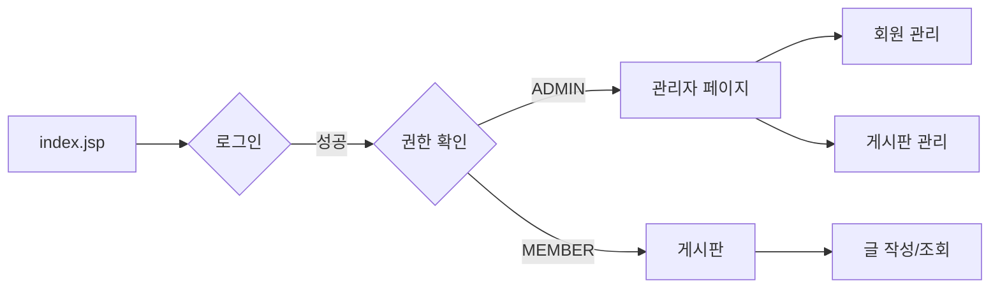
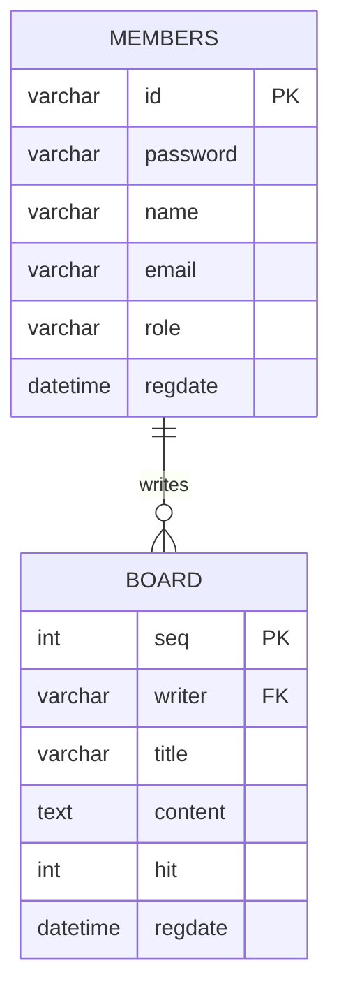

# 통합 JSP 프로젝트 가이드 V3 (최종)

> [!NOTE]
> **V3 업데이트 사항**
> 
> - ✅ 실제 완성된 board-project 구조 반영 (28 Java파일, 19 JSP파일)
> - ✅ 상품 관리 제외 (게시판 & 게시판 관리에 집중)
> - ✅ test 폴더 및 devMode.jsp 제거 완료
> - ✅ 세션 기반 회원 연동 게시판 완성
> 
> **역할**:
> - 기술 구현 방법 (패턴, 아키텍처, 코드 예시)
> - Git 협업, 브랜치 전략 → **`팀원별_브랜치_작업_가이드.md`** 참조
> - 회원 연동 개념 설명 → **`회원_연동_통합_가이드.md`** 참조

---

## 📋 프로젝트 개요

### 기반 프로젝트
- **web-study-09**: 회원 관리 시스템
- **web-study-11**: 게시판 시스템 (Front Controller 패턴)
- **통합 방식**: 세션 기반 회원 연동

### 핵심 기능
1. **인증**: 회원가입 (일반/관리자), 로그인, 세션 관리
2. **권한**: MEMBER (일반 회원), ADMIN (관리자)
3. **게시판**: 로그인한 사용자만 글 작성, 본인 글만 수정/삭제
4. **관리**: 관리자는 모든 게시글 관리 + 회원 관리

---

## 📁 프로젝트 폴더 구조 (실제 완성본)

```
board-project/
├── src/main/java/
│   ├── com/saeyan/
│   │   ├── controller/               # 🎯 Front Controller
│   │   │   ├── MemberServlet.java
│   │   │   ├── BoardServlet.java
│   │   │   ├── AdminServlet.java
│   │   │   ├── ActionFactory.java
│   │   │   │
│   │   │   └── action/
│   │   │       ├── Action.java       # 인터페이스
│   │   │       │
│   │   │       ├── member/           # 6개 파일
│   │   │       │   ├── LoginFormAction.java
│   │   │       │   ├── LoginAction.java
│   │   │       │   ├── LogoutAction.java
│   │   │       │   ├── JoinFormAction.java
│   │   │       │   ├── JoinAction.java
│   │   │       │   └── UpdateAction.java
│   │   │       │
│   │   │       ├── board/            # 7개 파일
│   │   │       │   ├── BoardListAction.java
│   │   │       │   ├── BoardViewAction.java
│   │   │       │   ├── BoardWriteFormAction.java
│   │   │       │   ├── BoardWriteAction.java
│   │   │       │   ├── BoardUpdateFormAction.java
│   │   │       │   ├── BoardUpdateAction.java
│   │   │       │   └── BoardDeleteAction.java
│   │   │       │
│   │   │       └── admin/            # 6개 파일
│   │   │           ├── AdminMainAction.java
│   │   │           ├── MemberListAction.java
│   │   │           ├── MemberDetailAction.java
│   │   │           ├── BoardManageListAction.java
│   │   │           ├── BoardManageUpdateAction.java
│   │   │           └── BoardManageDeleteAction.java
│   │   │
│   │   ├── dao/
│   │   │   ├── MemberDAO.java
│   │   │   └── BoardDAO.java
│   │   │
│   │   └── dto/
│   │       ├── MemberVO.java
│   │       └── BoardVO.java          # writer 필드 (세션 기반)
│   │
│   └── util/
│       └── DBManager.java
│
└── src/main/webapp/
    ├── index.jsp
    ├── error.jsp
    │
    ├── member/                       # 5개 JSP
    │   ├── login.jsp
    │   ├── join.jsp
    │   ├── idCheck.jsp
    │   ├── main.jsp
    │   └── memberUpdate.jsp
    │
    ├── board/                        # 3개 JSP (깔끔!)
    │   ├── boardList.jsp
    │   ├── boardWrite.jsp            # ✅ 세션 연동 완료
    │   └── boardView.jsp             # ✅ 권한 체크 완료
    │
    ├── admin/                        # 5개 JSP
    │   ├── adminMain.jsp
    │   ├── member/
    │   │   ├── memberList.jsp
    │   │   └── memberDetail.jsp
    │   └── board/
    │       ├── boardManage.jsp
    │       └── boardManageDelete.jsp
    │
    ├── common/                       # 4개 JSP
    │   ├── checkLogin.jsp            # 로그인 체크
    │   ├── checkAdmin.jsp            # 관리자 체크
    │   ├── header.jsp
    │   └── footer.jsp
    │
    ├── css/
    │   └── style.css
    │
    └── script/
        └── common.js
```

> [!IMPORTANT]
> **왜 깔끔한가?**
> - ❌ 비밀번호 확인 파일 없음 (boardCheckPass.jsp, checkSuccess.jsp)
> - ❌ 개발용 파일 없음 (test/testLogin.jsp, devMode.jsp)
> - ✅ 세션 기반 권한 관리로 단순화
> - ✅ Front Controller 패턴으로 구조화

---

## 🏗️ Front Controller 패턴 (web-study-11 스타일)

### 핵심 구조

```
사용자 요청
    ↓
하나의 Servlet (BoardServlet)
    ↓
ActionFactory (command 분석)
    ↓
적절한 Action 실행 (BoardListAction)
    ↓
DAO → DB
    ↓
JSP로 forward
```

### URL 패턴 예시

| 기능 | URL |
|------|-----|
| 로그인 폼 | `/MemberServlet?command=login_form` |
| 로그인 처리 | `/MemberServlet?command=login` (POST) |
| 게시판 목록 | `/BoardServlet?command=board_list` |
| 게시글 작성 | `/BoardServlet?command=board_write_form` |
| 게시글 상세 | `/BoardServlet?command=board_view&seq=1` |
| 관리자 메인 | `/AdminServlet?command=admin_main` |

---

## 🔄 사용자 플로우



**핵심:**
- 관리자 → 모든 게시글 관리 가능
- 일반 회원 → 본인 글만 수정/삭제
- 세션으로 자동 권한 확인

---

## 🗄️ 데이터베이스 스키마

### members 테이블
```sql
CREATE TABLE members (
    id VARCHAR(50) PRIMARY KEY,
    password VARCHAR(100) NOT NULL,
    name VARCHAR(50) NOT NULL,
    email VARCHAR(100),
    role VARCHAR(20) DEFAULT 'MEMBER',  -- 'MEMBER' or 'ADMIN'
    phone VARCHAR(20),
    regdate DATETIME DEFAULT CURRENT_TIMESTAMP
);
```

### board 테이블 (회원 연동형)
```sql
CREATE TABLE board (
    seq INT AUTO_INCREMENT PRIMARY KEY,
    writer VARCHAR(50) NOT NULL,        -- members.id FK
    title VARCHAR(200) NOT NULL,
    content TEXT NOT NULL,
    hit INT DEFAULT 0,
    regdate DATETIME DEFAULT CURRENT_TIMESTAMP,
    FOREIGN KEY (writer) REFERENCES members(id) ON DELETE CASCADE
);
```

**핵심 차이 (vs web-study-11):**
- ✅ `writer` - 로그인한 사용자 ID (FK)
- ❌ `name`, `pass`, `email` - 제거 (members 조인)

---

## 💻 핵심 구현 코드

### 1. BoardVO (회원 연동형)

```java
public class BoardVO {
    private int seq;
    private String writer;      // ← members.id
    private String title;
    private String content;
    private int hit;
    private Timestamp regdate;
    
    // getter/setter...
}
```

### 2. boardWrite.jsp (세션 기반)

```jsp
<%@ include file="../common/checkLogin.jsp" %>
<%
    String userId = (String) session.getAttribute("userId");
    String userName = (String) session.getAttribute("userName");
%>

<form action="../BoardServlet?command=board_write" method="post">
    <input type="hidden" name="writer" value="<%= userId %>">
    
    <div>
        <label>작성자:</label>
        <span><%= userName %></span>  <!-- 수정 불가 -->
    </div>
    
    <div>
        <label>제목:</label>
        <input type="text" name="title" required>
    </div>
    
    <div>
        <label>내용:</label>
        <textarea name="content" required></textarea>
    </div>
    
    <button type="submit">등록</button>
</form>
```

### 3. BoardWriteAction

```java
public String execute(HttpServletRequest request, HttpServletResponse response) {
    HttpSession session = request.getSession();
    String userId = (String) session.getAttribute("userId");
    
    if(userId == null) {
        return "redirect:../member/login.jsp";
    }
    
    BoardVO vo = new BoardVO();
    vo.setWriter(userId);                          // 세션에서
    vo.setTitle(request.getParameter("title"));
    vo.setContent(request.getParameter("content"));
    
    BoardDAO.getInstance().insertBoard(vo);
    
    return "redirect:BoardServlet?command=board_list";
}
```

### 4. boardView.jsp (권한 체크)

```jsp
<%@ taglib prefix="c" uri="http://java.sun.com/jsp/jstl/core" %>

<div class="board-view">
    <div>제목: ${board.title}</div>
    <div>작성자: ${board.writer}</div>
    <div>내용: ${board.content}</div>
</div>

<!-- JSTL로 권한 체크 -->
<c:if test="${sessionScope.userId == board.writer || sessionScope.userRole == 'ADMIN'}">
    <a href="../BoardServlet?command=board_update_form&seq=${board.seq}">수정</a>
    <a href="../BoardServlet?command=board_delete&seq=${board.seq}" 
       onclick="return confirm('삭제하시겠습니까?')">삭제</a>
</c:if>

<a href="../BoardServlet?command=board_list">목록</a>
```

---

## 🎯 권한 관리 로직

### checkLogin.jsp (공통 로그인 체크)

```jsp
<%
    String userId = (String) session.getAttribute("userId");
    if (userId == null || userId.isEmpty()) {
        response.sendRedirect(request.getContextPath() + "/member/login.jsp");
        return;
    }
%>
```

### checkAdmin.jsp (관리자 체크)

```jsp
<%
    String userRole = (String) session.getAttribute("userRole");
    if (!"ADMIN".equals(userRole)) {
        response.sendRedirect(request.getContextPath() + "/error.jsp");
        return;
    }
%>
```

### 사용 예시

```jsp
<%-- 모든 게시판 페이지 상단에 --%>
<%@ include file="../common/checkLogin.jsp" %>

<%-- 관리자 페이지 상단에 --%>
<%@ include file="../common/checkAdmin.jsp" %>
```

---

## 🚀 Action 목록 및 역할

### Member Actions (6개)

| Action | 역할 | 반환 |
|--------|------|------|
| `LoginFormAction` | 로그인 폼 표시 | `member/login.jsp` |
| `LoginAction` | 로그인 처리, 세션 설정 | redirect (권한별 분기) |
| `LogoutAction` | 로그아웃, 세션 제거 | `member/login.jsp` |
| `JoinFormAction` | 회원가입 폼 표시 | `member/join.jsp` |
| `JoinAction` | 회원가입 처리 | `member/login.jsp` |
| `UpdateAction` | 회원정보 수정 | `member/main.jsp` |

### Board Actions (7개)

| Action | 역할 | 권한 체크 |
|--------|------|---------|
| `BoardListAction` | 게시글 목록 | 없음 (누구나) |
| `BoardViewAction` | 게시글 상세, 조회수 증가 | 없음 |
| `BoardWriteFormAction` | 작성 폼 표시 | 로그인 필요 |
| `BoardWriteAction` | 게시글 등록 | 로그인 필요 |
| `BoardUpdateFormAction` | 수정 폼 표시 | 작성자 or 관리자 |
| `BoardUpdateAction` | 게시글 수정 | 작성자 or 관리자 |
| `BoardDeleteAction` | 게시글 삭제 | 작성자 or 관리자 |

### Admin Actions (6개)

| Action | 역할 |
|--------|------|
| `AdminMainAction` | 관리자 대시보드 |
| `MemberListAction` | 전체 회원 목록 |
| `MemberDetailAction` | 회원 상세 정보 |
| `BoardManageListAction` | 전체 게시글 관리 목록 |
| `BoardManageUpdateAction` | 게시글 수정 (관리자) |
| `BoardManageDeleteAction` | 게시글 삭제 (관리자) |

---

## 📊 ERD



---

## ✅ 개발 완료 체크리스트

### 파일 구조
- [x] 28개 Java 파일 (Action 20개, Servlet 3개, DAO 2개, VO 2개, Factory 1개)
- [x] 19개 JSP 파일
- [x] checkLogin.jsp, checkAdmin.jsp 공통 파일
- [x] test 폴더 제거
- [x] devMode.jsp 제거

### 세션 연동
- [x] BoardVO에 writer 필드
- [x] boardWrite.jsp 세션 기반 writer 설정
- [x] boardView.jsp 권한 체크 (JSTL)
- [x] BoardWriteAction 로그인 체크

### 권한 관리
- [x] 일반 회원: 본인 글만 수정/삭제
- [x] 관리자: 모든 글 관리 가능
- [x] 로그인 안 하면 작성 불가

### 데이터베이스
- [x] board 테이블 writer 필드 (FK)
- [x] ON DELETE CASCADE
- [x] members 테이블 role 필드

---

## 🔗 참고 문서

| 문서 | 내용 |
|------|------|
| `회원_연동_통합_가이드.md` | 비밀번호 기반 → 세션 기반 전환 개념 |
| `SQL_설정_가이드.md` | 데이터베이스 설치 및 설정 |
| `팀원별_브랜치_작업_가이드.md` | Git 협업 및 브랜치 전략 |

---

## 📝 주요 변경 이력

**V3 (현재)**
- 실제 완성된 프로젝트 구조 반영
- 상품 관리 제외
- test 폴더 삭제
- 세션 기반 완성

**V2**
- 이론적 통합 가이드
- 상품 관리 포함
- test 폴더 설명

**V1**
- 초기 계획
