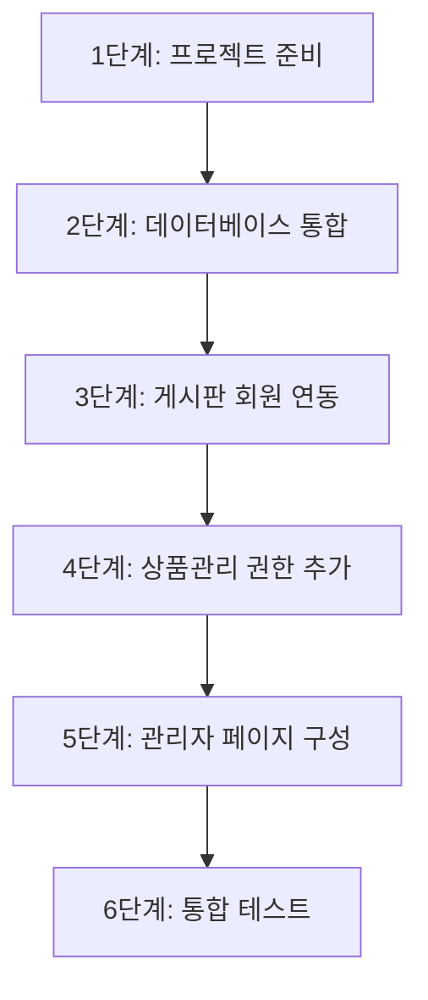

# 회원 연동 통합 프로젝트 완벽 가이드 (초보자용)

> 💡 **이 문서는 누구를 위한 것인가요?**
> 
> - web-study-09 (회원 관리), web-study-10 (상품 관리), web-study-11 (게시판)을 배운 초보자
> - 세 개의 독립적인 프로젝트를 하나로 통합하고 싶은 분
> - "회원 연동"이 정확히 무엇을 의미하는지 이해하고 싶은 분

---

## 📚 목차

1. [현재 상황: 독립적인 세 개의 프로젝트](#1-현재-상황-독립적인-세-개의-프로젝트)
2. [회원 연동이란 무엇인가?](#2-회원-연동이란-무엇인가)
3. [왜 비밀번호 기반을 제거해야 하나?](#3-왜-비밀번호-기반을-제거해야-하나)
4. [세션 기반 권한 관리란?](#4-세션-기반-권한-관리란)
5. [통합 프로세스 전체 흐름](#5-통합-프로세스-전체-흐름)
6. [단계별 상세 가이드](#6-단계별-상세-가이드)
7. [FAQ - 자주 묻는 질문](#7-faq-자주-묻는-질문)

---

## 1. 현재 상황: 독립적인 세 개의 프로젝트

### 📦 web-study-09: 회원 관리 시스템

**기능:**
- 회원가입 (일반 회원, 관리자)
- 로그인
- 회원정보 수정

**특징:**
- ✅ 로그인하면 **세션에 사용자 정보 저장**
- ✅ `session.getAttribute("userId")` 로 사용자 확인 가능
- ✅ 이미 회원 연동 준비 완료!

**DB 테이블:**
```sql
members (id, password, name, email, role, phone, regdate)
```

---

### 📦 web-study-10: 상품 관리 시스템

**기능:**
- 상품 목록 조회
- 상품 추가/수정/삭제

**특징:**
- ❌ 로그인 없이 누구나 접근 가능
- ❌ 관리자만 사용해야 하는데, 권한 체크가 없음

**DB 테이블:**
```sql
product (code, name, price, stock, description)
```

**문제점:**
```
상황: 누구든지 http://localhost:8080/상품관리 접속 가능
해결 필요: 관리자만 접근하도록 제한
```

---

### 📦 web-study-11: 게시판 시스템

**기능:**
- 게시글 목록/작성/조회/수정/삭제

**특징:**
- ❌ **비밀번호 기반**: 게시글마다 비밀번호를 입력해서 작성
- ❌ 수정/삭제할 때 비밀번호 입력 필요
- ❌ 작성한 사람이 누구인지 추적 불가 (이름만 입력)

**DB 테이블:**
```sql
board (num, name, pass, email, title, content, readcount, writedate)
```

**문제점:**
```
상황 1: 아무나 게시글 작성 가능 (로그인 없이)
상황 2: 비밀번호를 잊으면 자기 글도 수정/삭제 불가
상황 3: 누가 쓴 글인지 확실하지 않음 (이름을 마음대로 입력 가능)
```

---

## 2. 회원 연동이란 무엇인가?

### 🎯 회원 연동의 정의

**회원 연동 = 로그인한 사용자의 정보를 다른 기능에서도 활용하는 것**

#### 통합 전 (독립적)

```
로그인 (web-study-09)     게시판 (web-study-11)      상품관리 (web-study-10)
     ↓                          ↓                          ↓
 세션에 userId 저장        비밀번호로 권한 확인       권한 확인 없음
     ↓                          ↓                          ↓
   연결 없음                 연결 없음                  연결 없음
```

#### 통합 후 (회원 연동)

```
                    로그인 (web-study-09)
                           ↓
                 세션에 userId, userRole 저장
                           ↓
        ┌─────────────────┼─────────────────┐
        ↓                 ↓                 ↓
   게시판              상품관리           관리자페이지
세션에서 userId 확인   세션에서 role 확인   세션에서 role 확인
작성자 자동 설정       ADMIN만 접근        ADMIN만 접근
```

### 💡 핵심 개념

| 구분 | 독립적 | 회원 연동 |
|------|--------|----------|
| **로그인 정보** | 각 기능마다 별도 관리 | 세션으로 공유 |
| **권한 확인** | 비밀번호 입력 | 세션 확인 |
| **데이터 연결** | 없음 | Foreign Key로 연결 |
| **사용자 추적** | 불가능 | 가능 (members 테이블 조인) |

---

## 3. 왜 비밀번호 기반을 제거해야 하나?

### 🔴 비밀번호 기반의 문제점

#### 상황 1: 게시글 작성

**web-study-11 (비밀번호 기반):**

```jsp
<!-- boardWrite.jsp -->
<tr>
    <th>작성자</th>
    <td><input type="text" name="name" placeholder="홍길동"> ← 이름 마음대로 입력</td>
</tr>
<tr>
    <th>비밀번호</th>
    <td><input type="password" name="pass"> ← 게시글 비밀번호 직접 입력</td>
</tr>
```

**문제점:**
```
1. 로그인 없이도 글 작성 가능
   → 아무나 아무 이름으로 글 작성 가능
   
2. 비밀번호를 잊으면?
   → 자기 글도 수정/삭제 불가능
   
3. 누가 쓴 글인지 확인 불가
   → "홍길동"이 여러 명일 수 있음
```

---

#### 상황 2: 게시글 수정/삭제

**web-study-11 (비밀번호 기반):**

```java
// BoardCheckPassAction.java
String inputPass = request.getParameter("pass");  // 사용자가 입력한 비밀번호
String dbPass = board.getPass();                   // DB에 저장된 비밀번호

if (!inputPass.equals(dbPass)) {
    // 비밀번호 불일치
    return "board/boardCheckPass.jsp";  // 다시 입력!
}
```

**사용자 경험:**
```
1. 게시글 수정 버튼 클릭
   ↓
2. 팝업창에서 비밀번호 입력 (boardCheckPass.jsp)
   ↓
3. 비밀번호 맞으면 → 수정 페이지
   비밀번호 틀리면 → 다시 입력
```

**문제점:**
```
- 매번 비밀번호 입력 필요
- 비밀번호 잊으면 끝
- 관리자도 비밀번호 모르면 삭제 불가
```

---

### 🟢 회원 연동 (세션 기반)의 장점

#### 상황 1: 게시글 작성

**통합 프로젝트 (세션 기반):**

```jsp
<!-- boardWrite.jsp -->
<%
    // 세션에서 로그인 정보 가져오기
    String userId = (String) session.getAttribute("userId");
    String userName = (String) session.getAttribute("userName");
    
    // 로그인 안 했으면 로그인 페이지로
    if(userId == null) {
        response.sendRedirect("../member/login.jsp");
        return;
    }
%>

<tr>
    <th>작성자</th>
    <td><%= userName %></td>  ← 세션에서 자동으로 가져옴 (수정 불가)
    <input type="hidden" name="writer" value="<%= userId %>">
</tr>
<!-- 비밀번호 입력란 없음! -->
```

**장점:**
```
1. 로그인한 사람만 글 작성 가능 ✅
2. 작성자 정보 자동 설정 ✅
3. 작성자 위조 불가능 ✅
4. 비밀번호 기억할 필요 없음 ✅
```

---

#### 상황 2: 게시글 수정/삭제

**통합 프로젝트 (세션 기반):**

```java
// BoardUpdateAction.java
// 세션에서 로그인 정보 가져오기
String sessionUserId = (String) session.getAttribute("userId");
String sessionUserRole = (String) session.getAttribute("userRole");

// 게시글 정보 가져오기
BoardVO board = dao.selectOneBySeq(seq);

// 권한 체크: 작성자 본인이거나 관리자
boolean canEdit = sessionUserId.equals(board.getWriter()) ||  // 본인 확인
                  "ADMIN".equals(sessionUserRole);            // 관리자 확인

if (!canEdit) {
    // 권한 없음
    return "redirect:boardList.jsp";
}

// 수정 처리...
```

**사용자 경험:**
```
1. 게시글 수정 버튼 클릭
   ↓
2. 바로 수정 페이지로 이동 (비밀번호 입력 불필요!)
   ↓
3. 세션으로 자동 권한 확인
```

**장점:**
```
- 비밀번호 입력 불필요 ✅
- 본인 글만 수정 버튼 표시 ✅
- 관리자는 모든 글 수정 가능 ✅
- 팝업창 불필요 ✅
```

---

## 4. 세션 기반 권한 관리란?

### 🔐 세션이란?

**세션 = 서버가 사용자별로 임시 저장하는 데이터**

```
브라우저 A (홍길동)                서버
    ↓                               ↓
로그인 성공                    세션 생성
    ↓                               ↓
                            userId: "hong"
                            userName: "홍길동"
                            userRole: "MEMBER"
    ↓                               ↓
게시판 접속 요청                세션 확인
    ↓                               ↓
                            "hong" 사용자구나!
                            게시글 조회 허용
```

### 📝 세션 사용 예시

#### 로그인 시 (세션 저장)

```java
// LoginAction.java
MemberVO member = dao.login(id, password);

if (member != null) {
    // 로그인 성공 → 세션에 저장
    HttpSession session = request.getSession();
    session.setAttribute("userId", member.getId());       // "hong"
    session.setAttribute("userName", member.getName());   // "홍길동"
    session.setAttribute("userRole", member.getRole());   // "MEMBER" 또는 "ADMIN"
}
```

#### 게시글 작성 시 (세션 사용)

```java
// BoardWriteAction.java
HttpSession session = request.getSession();

// 세션에서 꺼내기
String userId = (String) session.getAttribute("userId");  // "hong"

// 로그인 안 했으면 null
if (userId == null) {
    return "redirect:../member/login.jsp";
}

// 게시글에 작성자 저장
BoardVO vo = new BoardVO();
vo.setWriter(userId);  // "hong" 저장
```

#### 권한 확인 시 (세션으로 체크)

```java
// 현재 로그인한 사용자
String sessionUserId = (String) session.getAttribute("userId");      // "hong"
String sessionUserRole = (String) session.getAttribute("userRole");  // "MEMBER"

// 게시글 작성자
String boardWriter = board.getWriter();  // "hong"

// 권한 체크
if (sessionUserId.equals(boardWriter)) {
    // 본인 글이면 수정/삭제 가능
}

if ("ADMIN".equals(sessionUserRole)) {
    // 관리자면 모든 글 수정/삭제 가능
}
```

---

## 5. 통합 프로세스 전체 흐름

### 🗺️ 통합 로드맵



### 📋 각 단계별 작업

| 단계 | 작업 내용 | 난이도 |
|------|-----------|--------|
| **1단계** | 세 프로젝트를 하나의 프로젝트로 병합 | ⭐ 쉬움 |
| **2단계** | board 테이블 수정 (writer 필드 추가) | ⭐ 쉬움 |
| **3단계** | 게시판에서 비밀번호 제거, 세션 연동 | ⭐⭐ 보통 |
| **4단계** | 상품관리에 관리자 권한 체크 추가 | ⭐ 쉬움 |
| **5단계** | 관리자 메인 페이지 구성 | ⭐⭐ 보통 |
| **6단계** | 전체 기능 테스트 | ⭐⭐⭐ 어려움 |

---

## 6. 단계별 상세 가이드

### 1️⃣ 단계 1: 프로젝트 준비

#### 목표
세 개의 독립 프로젝트를 하나의 프로젝트로 합치기

#### 작업

**폴더 구조:**
```
board-project/
├── src/main/java/
│   └── com/saeyan/
│       ├── controller/
│       │   ├── MemberServlet.java     (web-study-09)
│       │   ├── BoardServlet.java      (web-study-11)
│       │   └── ProductServlet.java    (web-study-10)
│       ├── dao/
│       │   ├── MemberDAO.java
│       │   ├── BoardDAO.java
│       │   └── ProductDAO.java
│       └── dto/
│           ├── MemberVO.java
│           ├── BoardVO.java
│           └── ProductVO.java
└── src/main/webapp/
    ├── member/    (web-study-09)
    ├── board/     (web-study-11)
    └── product/   (web-study-10)
```

---

### 2️⃣ 단계 2: 데이터베이스 통합

#### 목표
board 테이블을 members 테이블과 연결

#### 작업

**AS-IS (web-study-11):**
```sql
CREATE TABLE board (
    num INT AUTO_INCREMENT PRIMARY KEY,
    name VARCHAR(30),         -- 작성자 이름 (수동 입력)
    pass VARCHAR(30),         -- 게시글 비밀번호
    email VARCHAR(30),        -- 이메일
    title VARCHAR(50),
    content VARCHAR(1000),
    readcount INT DEFAULT 0,
    writedate DATETIME DEFAULT CURRENT_TIMESTAMP
);
```

**TO-BE (통합 프로젝트):**
```sql
-- 기존 board 테이블 삭제
DROP TABLE IF EXISTS board;

-- 새로운 board 테이블 생성
CREATE TABLE board (
    seq INT AUTO_INCREMENT PRIMARY KEY,
    writer VARCHAR(50) NOT NULL,    -- members.id 참조
    title VARCHAR(200) NOT NULL,
    content TEXT NOT NULL,
    hit INT DEFAULT 0,
    regdate DATETIME DEFAULT CURRENT_TIMESTAMP,
    FOREIGN KEY (writer) REFERENCES members(id) ON DELETE CASCADE
);
```

**변경사항:**
- ✅ `writer` 필드: members 테이블의 id를 참조 (Foreign Key)
- ❌ `name`, `pass`, `email` 제거: members 테이블에서 조인으로 가져옴

---

### 3️⃣ 단계 3: 게시판 회원 연동

#### 목표
비밀번호 기반 → 세션 기반으로 전환

#### 3-1. BoardVO 수정

**AS-IS:**
```java
public class BoardVO {
    private int num;
    private String name;     // 제거할 필드
    private String pass;     // 제거할 필드
    private String email;    // 제거할 필드
    private String title;
    private String content;
    private int readcount;
    private Timestamp writedate;
}
```

**TO-BE:**
```java
public class BoardVO {
    private int seq;            // num → seq
    private String writer;      // name → writer (회원 ID)
    private String title;
    private String content;
    private int hit;            // readcount → hit
    private Timestamp regdate;  // writedate → regdate
    
    // JOIN으로 가져올 회원 정보 (임시 필드)
    private String writerName;  // members 테이블에서 조인
    private String writerEmail; // members 테이블에서 조인
    
    // getter/setter...
}
```

---

#### 3-2. boardWrite.jsp 수정

**AS-IS (web-study-11):**
```jsp
<%@ page language="java" contentType="text/html; charset=UTF-8" pageEncoding="UTF-8"%>
<h1>게시글 등록</h1>
<form action="BoardServlet" method="post">
    <input type="hidden" name="command" value="board_write">
    
    <tr>
        <th>작성자</th>
        <td><input type="text" name="name"> * 필수</td>
    </tr>
    <tr>
        <th>비밀번호</th>
        <td><input type="password" name="pass"> * 필수</td>
    </tr>
    <tr>
        <th>이메일</th>
        <td><input type="text" name="email"></td>
    </tr>
    <tr>
        <th>제목</th>
        <td><input type="text" name="title"></td>
    </tr>
    <tr>
        <th>내용</th>
        <td><textarea name="content"></textarea></td>
    </tr>
</form>
```

**TO-BE (통합 프로젝트):**
```jsp
<%@ page language="java" contentType="text/html; charset=UTF-8" pageEncoding="UTF-8"%>

<%-- 로그인 체크 --%>
<%
    String userId = (String) session.getAttribute("userId");
    String userName = (String) session.getAttribute("userName");
    
    if (userId == null) {
        // 로그인 안 했으면 로그인 페이지로
        response.sendRedirect("../member/login.jsp");
        return;
    }
%>

<h1>게시글 등록</h1>
<form action="BoardServlet" method="post">
    <input type="hidden" name="command" value="board_write">
    <input type="hidden" name="writer" value="<%= userId %>">  <%-- 세션에서 자동 설정 --%>
    
    <tr>
        <th>작성자</th>
        <td><%= userName %> (로그인한 사용자)</td>  <%-- 수정 불가, 표시만 --%>
    </tr>
    <%-- name, pass, email 입력란 완전히 제거! --%>
    
    <tr>
        <th>제목</th>
        <td><input type="text" name="title" required></td>
    </tr>
    <tr>
        <th>내용</th>
        <td><textarea name="content" required></textarea></td>
    </tr>
</form>
```

**핵심 변경:**
1. ✅ 로그인 체크 추가: `userId == null` 이면 로그인 페이지로
2. ✅ writer는 hidden 필드로 세션에서 가져온 값 자동 설정
3. ❌ name, pass, email 입력란 완전히 제거

---

#### 3-3. BoardWriteAction 수정

**AS-IS (web-study-11):**
```java
public class BoardWriteAction implements Action {
    @Override
    public String execute(HttpServletRequest request, HttpServletResponse response) {
        String name = request.getParameter("name");      // 폼에서 입력
        String pass = request.getParameter("pass");      // 폼에서 입력
        String email = request.getParameter("email");    // 폼에서 입력
        String title = request.getParameter("title");
        String content = request.getParameter("content");
        
        BoardVO vo = new BoardVO();
        vo.setName(name);
        vo.setPass(pass);
        vo.setEmail(email);
        vo.setTitle(title);
        vo.setContent(content);
        
        BoardDAO dao = BoardDAO.getInstance();
        dao.insertBoard(vo);
        
        return "redirect:BoardServlet?command=board_list";
    }
}
```

**TO-BE (통합 프로젝트):**
```java
public class BoardWriteAction implements Action {
    @Override
    public String execute(HttpServletRequest request, HttpServletResponse response) {
        // 세션에서 로그인 정보 가져오기
        HttpSession session = request.getSession();
        String userId = (String) session.getAttribute("userId");
        
        // 로그인 체크 (이중 체크)
        if (userId == null) {
            return "redirect:../member/login.jsp";
        }
        
        // 폼에서 데이터 받기
        String writer = request.getParameter("writer");  // hidden 필드에서
        String title = request.getParameter("title");
        String content = request.getParameter("content");
        
        // 보안: 세션의 userId와 파라미터의 writer가 일치하는지 확인
        if (!userId.equals(writer)) {
            // 누군가 다른 사람 ID로 작성 시도!
            return "redirect:error.jsp";
        }
        
        BoardVO vo = new BoardVO();
        vo.setWriter(writer);    // name 대신 writer
        vo.setTitle(title);
        vo.setContent(content);
        // pass, email은 설정하지 않음
        
        BoardDAO dao = BoardDAO.getInstance();
        dao.insertBoard(vo);
        
        return "redirect:BoardServlet?command=board_list";
    }
}
```

**핵심 변경:**
1. ✅ 세션에서 userId 가져오기
2. ✅ 로그인 체크 추가
3. ✅ writer 설정 (name 대신)
4. ✅ 보안 체크: 세션 userId와 파라미터 writer 일치 확인
5. ❌ pass, email 관련 코드 제거

---

#### 3-4. boardView.jsp 수정 (수정/삭제 버튼)

**AS-IS (web-study-11):**
```jsp
<!-- 모든 게시글에 수정/삭제 버튼 표시 -->
<input type="button" value="게시글 수정" 
    onclick="open_win('BoardServlet?command=board_check_pass_form&num=${board.num}&action=update', 'update')">
<input type="button" value="게시글 삭제"
    onclick="open_win('BoardServlet?command=board_check_pass_form&num=${board.num}&action=delete', 'delete')">
```

**TO-BE (통합 프로젝트):**
```jsp
<%
    String sessionUserId = (String) session.getAttribute("userId");
    String sessionUserRole = (String) session.getAttribute("userRole");
    
    // 권한 체크: 작성자 본인이거나 관리자
    boolean canEdit = (sessionUserId != null) &&
                      (sessionUserId.equals(board.getWriter()) ||  // 본인 확인
                       "ADMIN".equals(sessionUserRole));           // 관리자 확인
%>

<% if (canEdit) { %>
    <!-- 권한이 있을 때만 버튼 표시 -->
    <input type="button" value="게시글 수정" 
        onclick="location.href='BoardServlet?command=board_update_form&seq=${board.seq}'">
    <input type="button" value="게시글 삭제"
        onclick="if(confirm('정말 삭제하시겠습니까?')) location.href='BoardServlet?command=board_delete&seq=${board.seq}'">
<% } else { %>
    <!-- 권한 없으면 버튼 미표시 -->
    <p style="color:gray;">작성자와 관리자만 수정/삭제할 수 있습니다.</p>
<% } %>
```

**핵심 변경:**
1. ✅ 세션에서 userId와 userRole 가져오기
2. ✅ 권한 체크: `sessionUserId == board.writer` 또는 `role == ADMIN`
3. ✅ 권한 있을 때만 버튼 표시
4. ❌ 비밀번호 확인 팝업 제거 (`board_check_pass_form`)

---

#### 3-5. 삭제할 파일들

**완전히 삭제:**
```bash
# 비밀번호 확인 관련 JSP
rm src/main/webapp/board/boardCheckPass.jsp
rm src/main/webapp/board/checkSuccess.jsp

# 비밀번호 확인 관련 Action
rm src/main/java/com/saeyan/controller/action/BoardCheckPassFormAction.java
rm src/main/java/com/saeyan/controller/action/BoardCheckPassAction.java
```

**ActionFactory.java에서 제거:**
```java
// 이 부분들 삭제!
// } else if(command.equals("board_check_pass_form")) {
//     action = new BoardCheckPassFormAction();
// } else if(command.equals("board_check_pass")) {
//     action = new BoardCheckPassAction();
```

**왜 삭제하나요?**
- 비밀번호 확인 팝업이 필요 없어졌기 때문
- 세션으로 자동 권한 체크를 하므로

---

### 4️⃣ 단계 4: 상품관리 권한 추가

#### 목표
관리자만 상품관리 페이지에 접근 가능하도록

#### 작업

**모든 상품 관련 JSP에 추가:**
```jsp
<%@ page language="java" contentType="text/html; charset=UTF-8" pageEncoding="UTF-8"%>

<%-- 관리자 권한 체크 --%>
<%
    String userRole = (String) session.getAttribute("userRole");
    
    if (!"ADMIN".equals(userRole)) {
        // 관리자가 아니면 접근 거부
        response.sendRedirect("../error/accessDenied.jsp");
        return;
    }
%>

<!-- 상품관리 화면 -->
```

---

### 5️⃣ 단계 5: 관리자 페이지 구성

#### 목표
관리자가 한 곳에서 모든 관리 기능 접근

#### adminMain.jsp 생성

```jsp
<%@ page language="java" contentType="text/html; charset=UTF-8" pageEncoding="UTF-8"%>

<%-- 관리자 체크 --%>
<%
    String userRole = (String) session.getAttribute("userRole");
    String userName = (String) session.getAttribute("userName");
    
    if (!"ADMIN".equals(userRole)) {
        response.sendRedirect("../member/login.jsp");
        return;
    }
%>

<h1>관리자 페이지</h1>
<p>환영합니다, <%= userName %> 관리자님</p>

<div class="menu">
    <h2>관리 기능</h2>
    <ul>
        <li><a href="../AdminServlet?command=member_list">회원 관리</a></li>
        <li><a href="../AdminServlet?command=product_list">상품 관리</a></li>
        <li><a href="../AdminServlet?command=board_manage_list">게시판 관리</a></li>
    </ul>
</div>

<a href="../MemberServlet?command=logout">로그아웃</a>
```

---

## 7. FAQ - 자주 묻는 질문

### Q1. "통합 시 제거"가 정확히 무슨 뜻인가요?

**A:** web-study-11의 비밀번호 기반 권한 관리를 **세션 기반으로 대체**한다는 의미입니다.

**제거할 것들:**
1. JSP 파일:
   - `boardCheckPass.jsp` (비밀번호 입력 팝업)
   - `checkSuccess.jsp` (확인 성공 처리)

2. Action 클래스:
   - `BoardCheckPassFormAction.java`
   - `BoardCheckPassAction.java`

3. BoardVO 필드:
   - `name`, `pass`, `email`

4. 테이블 컬럼:
   - `name`, `pass`, `email`

**대체할 것들:**
```java
// 기존: 비밀번호 확인
if (!inputPass.equals(board.getPass())) {
    return "비밀번호가 틀렸습니다";
}

// 변경: 세션 확인
String sessionUserId = (String) session.getAttribute("userId");
if (!sessionUserId.equals(board.getWriter())) {
    return "권한이 없습니다";
}
```

---

### Q2. 세션은 언제 생성되고 언제 삭제되나요?

**A:**

**생성 시점:**
```java
// 로그인 성공 시
HttpSession session = request.getSession();
session.setAttribute("userId", "hong");
```

**삭제 시점:**
1. 로그아웃 버튼 클릭:
```java
session.invalidate();  // 세션 삭제
```

2. 브라우저 종료

3. 일정 시간(30분) 동안 활동 없음

---

### Q3. 관리자는 어떻게 모든 게시글을 관리할 수 있나요?

**A:** `userRole` 체크로 가능합니다.

```java
String sessionUserRole = (String) session.getAttribute("userRole");

// 일반 회원: 본인 글만 수정 가능
if (sessionUserId.equals(board.getWriter())) {
    // 수정 가능
}

// 관리자: 모든 글 수정 가능
if ("ADMIN".equals(sessionUserRole)) {
    // 무조건 수정 가능
}

// 합쳐서
boolean canEdit = sessionUserId.equals(board.getWriter()) ||
                  "ADMIN".equals(sessionUserRole);
```

---

### Q4. 기존 데이터는 어떻게 하나요?

**A:** web-study-11에서 작성한 게시글은 **변환이 필요**합니다.

**방법 1: 새로 시작** (권장)
```sql
-- 기존 테이블 삭제하고 새로 생성
DROP TABLE board;
CREATE TABLE board (...);
```

**방법 2: 데이터 변환**
```sql
-- 기존 데이터를 새 테이블로 복사
INSERT INTO board_new (seq, writer, title, content, hit, regdate)
SELECT num, 
       'admin',  -- 모든 글의 작성자를 admin으로 설정
       title, content, readcount, writedate
FROM board_old;
```

---

### Q5. 테스트는 어떻게 하나요?

**체크리스트:**

- [ ] **로그인 테스트**
  - [ ] 일반 회원 로그인
  - [ ] 관리자 로그인

- [ ] **게시판 테스트**
  - [ ] 로그인 안 하고 게시판 접근 → 로그인 페이지로 이동
  - [ ] 로그인 후 글 작성 → 작성자가 자동으로 내 이름으로
  - [ ] 내 글 수정/삭제 → 가능
  - [ ] 남의 글 수정/삭제 → 버튼 미표시

- [ ] **관리자 테스트**
  - [ ] 관리자로 로그인 → adminMain.jsp로 이동
  - [ ] 모든 게시글 수정/삭제 가능
  - [ ] 상품 관리 페이지 접근 가능

- [ ] **일반 회원 테스트**
  - [ ] 일반 회원으로 로그인 → boardList.jsp로 이동
  - [ ] 상품 관리 페이지 접근 → 접근 거부

---

## ✅ 마무리

이 문서를 통해:
1. ✅ 독립 프로젝트와 통합 프로젝트의 차이 이해
2. ✅ 비밀번호 기반 vs 세션 기반 차이 이해
3. ✅ "통합 시 제거"의 정확한 의미 이해
4. ✅ 단계별 통합 프로세스 숙지

**다음 단계:**
- 실제 코드 작성하면서 하나씩 적용해보기
- 에러 발생 시 이 문서 참고하여 해결
